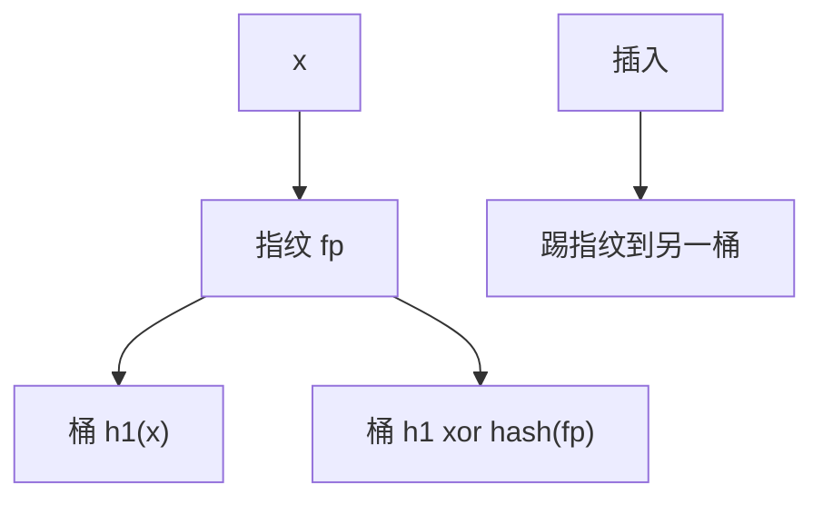

# 布谷过滤器

不存键，只存指纹；每个指纹两个候选桶，插入像布谷散列那样踢。删除可以摘掉指纹，Bloom 做不到。

<footer>—— 据 Fan, Andersen, Kaminsky and Mitzenmacher, Cuckoo Filter: Practically Better Than Bloom, CoNEXT 2014；Pagh and Rodler, Cuckoo Hashing 整理</footer>

[上一课](/cs/hyperloglog) 不支持成员。[布隆](/cs/bloom-filter) 假阳性、无删除（标准版）。[布谷散列](/cs/robin-cuckoo) 存真键。本课不估基数。缺口是 cuckoo filter：桶里是指纹，用 `h1` 与 `h1 xor hash(fp)` 定位。

## 问题

近似集：空间近 Bloom，但要删除、要查失败时仍紧凑。指纹 $\mathrm{fp}(x)$ 短，假阳性约桶负载与指纹位数决定。插入：两桶有空则放；否则踢走一个指纹到另一桶（由 fp 反推另一下标）。踢链过长则扩容或失败。缺口是**用指纹的异或关系代替存键**，使踢人仍能找到另一巢。

Fan et al., *CoNEXT*, 2014。半桶（bucket）存多个指纹，提高占用率。Pagh–Rodler 布谷给踢人算法。

## 方法

查找：检查两桶是否含 fp。删除：找到则删一个匹配指纹——可能误删同指纹的另一键，合同是近似。计数器 Bloom 可删但更费空间。

与 Bloom：$k$ 个独立位 vs 两桶指纹。布谷过滤器缓存局部性更好（查两桶），同空间下假阳性常更优（论文实验），本课用机制说话不抄表。

## 机制

另一桶必须由当前桶与 fp 算出，故不能只存无法反推的索引。负载因子过高踢失败，要留空。假阴性：标准正确实现查找不应假阴；误删造成假阴，删除须应用层保证「曾插入」。

商过滤器下一课用商+余数紧排，另一套可删近似集。

## 边界

本课不给对抗构造去刷误删。不把 CoNEXT 图表当正文。精确字典请回完美散列或 HAMT。

后课默认：可删近似成员可用布谷过滤器。紧凑商+余数布局用商过滤器。

## 小结

- 布谷过滤器：指纹 + 两巢踢人，可删。
- 假阳性由指纹长与负载决定。
- 下一课商过滤器换布局。
- 出处：Fan et al., *CoNEXT*, 2014；Pagh and Rodler。
