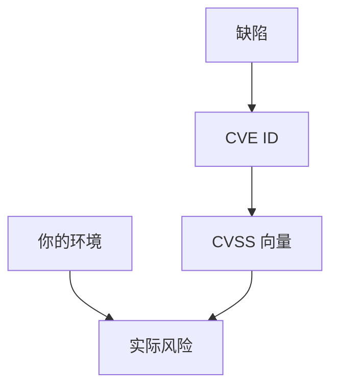

# CVE 与 CVSS

CVE 给缺陷一个名字；CVSS 给一个在特定环境下的严重度向量。编号不是风险本身，向量里的「网络可利用、无需交互」才是比较用的语言。

<footer>—— MITRE CVE；FIRST CVSS 规范；对照 NIST NVD</footer>

## 定位

上一课[审计](/cs/secure-coding-review)会产出缺陷。缺口是**对外语言**：CVE 与 CVSS。本课讲向量含义与误用（当唯一优先级），不教如何炒作漏洞。

后课默认已经读完本课钉下的合同，只补差，不从该领域第一性原理重开。

## 问题

内部票无法与供应商沟通。CVE：唯一 ID。CVSS：AV/AC/PR/UI 等。缺口是环境修正：隔离网络里的「网络可利用」不是互联网可利用。

### 评分会吵架

供应商与研究员对 UI、范围常不一致。要读向量不要只看十分制。

CVE 编号规则。CVSS v3.1/v4。本课不提供 0-day 市场操作。

## 方法

拆一组向量字段的含义。对照 EPSS 一类利用预测（点名）。下一课补丁与 N-day：分数高但未打的洞。

图中节点是本课的机制骨架；课程不把图展开成可运行的攻击步骤。

## 机制

治理需要可引用的对象。下一课补丁管理：N-day 是已公开未修补的窗口。

前提写进合同之后，游戏外的误用只当失败模式点名，不在本课写成操作程序。

## 边界

本课不教申请 CVE 的博弈。补丁与 N-day 下一课。

## 小结

- 审计结果要能对外命名。
- CVE 是 ID；CVSS 是向量，须经环境修正。
- 十分制不能单独当优先级。
- 下一课补丁与 N-day。
- 出处：MITRE CVE；FIRST CVSS；NIST NVD。
