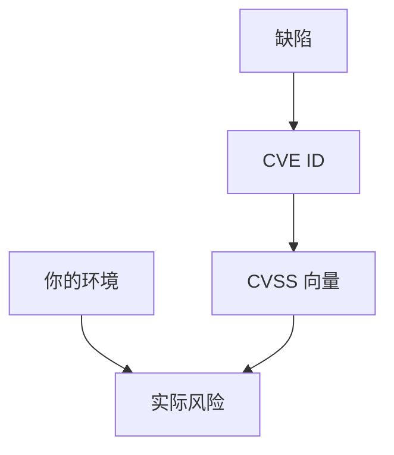
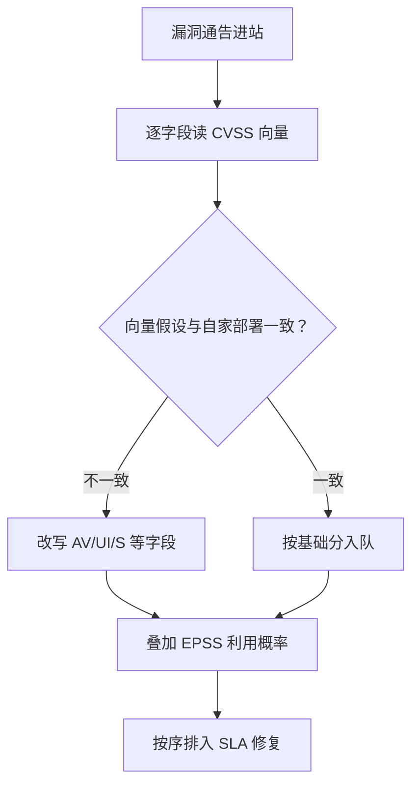

# CVE 与 CVSS

CVE 给缺陷一个名字；CVSS 给一个在特定环境下的严重度向量。编号不是风险本身，向量里的「网络可利用、无需交互」才是比较用的语言。

<footer>—— MITRE CVE；FIRST CVSS 规范；对照 NIST NVD</footer>

上一课[审计](/cs/secure-coding-review)会产出缺陷清单，但内部票号出不了公司。缺口是**对外语言**：CVE 与 CVSS。本课讲向量含义与误用（比如把分数当唯一优先级），不教如何炒作漏洞。

后课默认已经读完本课钉下的合同，只补差，不从该领域第一性原理重开。

## 问题

「我们系统里那个登录绕过」对供应商毫无信息量：他没法把它和别的报告对上，也没法判断严重到什么程度。CVE 解决命名：每条公开缺陷领一个唯一 ID，各方谈的是同一个对象。CVSS 解决比较：AV（攻击途径）、AC（复杂度）、PR（所需权限）、UI（是否需要交互）等字段构成向量，AV:N/AC:L/PR:N/UI:N 意为网络可达、低复杂度、无需权限、无需交互——正是最危险的形状。缺口是环境修正：隔离网络里的「网络可利用」不是互联网可利用，使用者要按自己的部署改写向量。

数字实例：CVE-2024-21762 里，2024 是年份、21762 是当年顺序号。门牌号不告诉你房子好坏——编号只保证"我们谈的是同一条"，好坏要读 CVSS 向量。

### 评分会吵架

同一缺陷，供应商倾向压低、研究员倾向抬高，分歧常集中在 UI 算不算用户配合、范围 S 是否跨权限域。要读向量不要只看十分制：8.8 与 9.8 的差别往往只是环境假设不同。

CVE 编号规则。CVSS v3.1/v4。本课不提供 0-day 市场操作。

## 方法

把一组真实向量逐字段拆开读，再按自家环境逐项修正：内网部署改 AV，统一网关改 UI，容器边界改 S。CVSS 量的是缺陷固有严重度，不是被利用的概率——对照 EPSS 一类利用预测（点名）：它用历史数据估计近期出现野外利用的可能，两者结合才接近优先级。下一课补丁与 N-day：分数高但未打的洞。

EPSS 可以类比为"天气预报"：CVSS 说这个漏洞本身有多凶，EPSS 估计它近期真被人打的概率。凶而少来的可以缓一缓；不最凶但天天有人打的，得先堵。

```mermaid
flowchart TD
  BUG["缺陷"] --> CVE["CVE ID"]
  CVE --> VEC["CVSS 向量"]
  ENV["你的环境"] --> RISK["实际风险"]
  VEC --> RISK
```

## 机制

治理需要可引用的对象：SLA 写「AV:N 且 PR:N 的高分洞 72 小时内修」，比写「严重的问题尽快修」可执行得多；修复率统计、版本对比也全挂在这套 ID 与向量上。把 CVSS 当唯一真相是典型失败：不给分的不重视，上了 9 分才动；环境修正被省掉后，隔离网络被互联网口径吓到，真正暴露的面反而没排上队。下一课补丁管理：N-day 是已公开未修补的窗口。

```mermaid
flowchart TD
  ADV["漏洞通告进站"] --> RD["逐字段读 CVSS 向量"]
  RD --> ENV{"向量假设与自家部署一致？"}
  ENV -->|"不一致"| FIX["改写 AV/UI/S 等字段"]
  ENV -->|"一致"| BASE["按基础分入队"]
  FIX --> COMB["叠加 EPSS 利用概率"]
  BASE --> COMB
  COMB --> SLA["按序排入 SLA 修复"]
```

初学者容易以为"分数是客观的"。向量里每个字母都是可争议的假设：UI 算不算用户点了一下链接、S 算不算跨出权限边界。同一漏洞 8.8 与 9.8 之争吵的是这些字母，不是算术。

## 边界

本课不教申请 CVE 的博弈——编号由 CNA 体系分配，讨价还价属于披露流程。补丁与 N-day 下一课。

## 小结

- 审计结果要能对外命名。
- CVE 是 ID；CVSS 是向量，须经环境修正。
- 十分制不能单独当优先级。
- 下一课补丁与 N-day。
- 出处：MITRE CVE；FIRST CVSS；NIST NVD。
