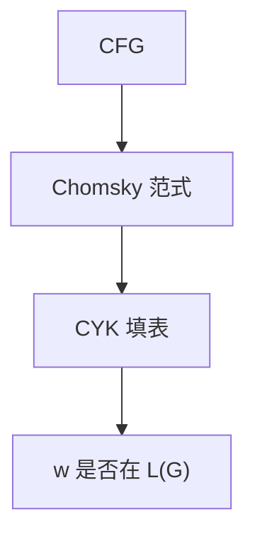

# CYK 与 CFL 判定

Chomsky 范式下，子串是否由某非终结符推出，可用动态规划在立方时间填表；一般 CFL 的成员问题因此可判定。

<footer>—— 据 Cocke；Kasami, 1965；Younger, 1967；Hopcroft and Ullman 整理</footer>

上一课[CFL 泵引理](/cs/pumping-lemma-cfl)只会排除，不会接收。主干[CFG](/cs/cfg-grammar)把分析算法留给「受限族」，并点名 CYK。缺口是：对**任意** CFG（先化成 CNF），成员问题 $w\in L(G)$ 可判定，复杂度 $O(n^3|G|)$，不是词法那条线性 DFA。

## 问题

PDA 非确定，直接模拟可能指数分叉。CNF：产生式仅 $A\to BC$ 或 $A\to a$。令 $V_{i,\ell}$ 为能推出子串 $w_i\cdots w_{i+\ell-1}$ 的非终结符集合。长度 1 查终结产生式；长度 $\ell$ 枚举切点，$A\to BC$ 当 $B$ 认左段、$C$ 认右段。$S\in V_{1,n}$ 当且仅当接受。

这是判定，顺便可得一棵（或所有）推导树。编程语言不用 CYK 当主分析器：立方太慢，且要 CNF；LL/LR 线性。本课要的是**一般 CFL 可判定**，对照后课图灵机的停机。

### CNF 不是「唯一树」

化 CNF 改写树的形状，语言不变。$\varepsilon$ 与单位产生式要先消去（空串单独处理）。二义文法会在表里留下多条组合，CYK 不负责消二义。

独立发现：Cocke、Kasami 1965、Younger 1967。龙书把它当一般 CFG 的 DP。Earley 算法覆盖更广的文法形状，本课不展开。

## 方法

给定 $G$ 与 $w$，先化 CNF，再填三角表。构造性：从 $S$ 回溯切点可建树。复杂度：每个格子 $O(\ell\cdot |P|)$，总 $O(n^3|G|)$。空语言、有限性对 CFL 也可判定；等价性不可判定——点名，不证。

主干[区间 DP](/cs/interval-dp) 已见按长度填区间；CYK 是同一张表，格子里是非终结符集合而非数值。

## 机制

可判定不等于高效，更不等于确定栈。CFL 的补不可判定是否 CFL，但给定固定 $G$，对每个 $w$ 仍可回答成员——$G$ 是算法的一部分。换一台机器认「任意 CFG 的任意 $w$」是另一问题（通用性），后课图灵机才需要。

DPDA / LR 把非确定压掉，换来线性；不是所有 CFG 都能这样。

表 $V_{i,\ell}$ 与区间 DP 同形，格子里是非终结符集合而非最优值。回溯切点可得一棵树；二义时多棵。CFL 空性：化 CNF 后看 $S$ 能否推出任何终结串，也可判定。等价、固有二义不可判定，本课点名，避免把「可判定」理解成「文法的一切性质」。

## 边界

本课不证 CFL 等价不可判定，不写 Earley。不把 CYK 当自然语言语法的充分模型。后课默认：CFL 成员可判定、多项式；下一层机器将越过可判定边界。图灵机是下一课。

固定文法的成员可判定，不等于文法等价可判定。编译前端仍走 LL/LR，是因为立方与 CNF 改写都不适合源级分析。图灵机将越过这层「总有算法」。

## 小结

- CNF + 区间 DP：一般 CFL 成员 $O(n^3)$ 可判定。
- 编译前端仍用 LL/LR；CYK 给理论闭合。
- 判定固定文法的成员，不是判定两文法是否等价。
- 出处：Kasami, 1965；Younger, 1967；Hopcroft and Ullman。
