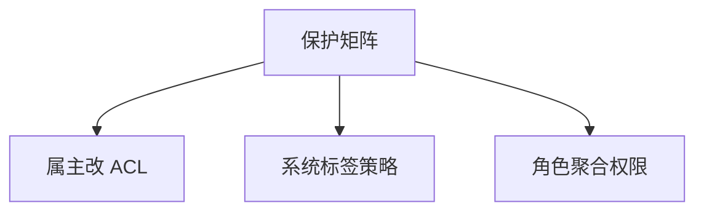

# DAC / MAC / RBAC

自主访问控制让属主改 ACL；强制访问控制用标签策略挡住「自愿泄露」；角色把权限聚成岗位而不是每人一条。

<footer>—— 据 Lampson 保护矩阵；Bell–LaPadula 对照；Sandhu 对 RBAC；Saltzer and Schroeder</footer>

[上一课](/cs/acl-least-priv)给出主体–客体–操作与最小特权。本课不重画矩阵。缺口是政策谁来写：属主（DAC）、系统标签（MAC）、岗位角色（RBAC）。能力下一课对照矩阵的另一种存放。三者都能表达同一矩阵的子集，失败模式不同。

## 问题

最小特权课留下矩阵。Unix 文件 mode 是 DAC：属主可 chmod 把读权给别人，木马也能借属主去改。MAC：级别与范畴，写不上读下一类规则（教学用 BLP 直觉），用户不能自愿改标签以泄密。RBAC：权限授给角色，人授角色，便于岗位变动。缺口是**三种政策来源**。

MLS 的形式模型有争议与例外。主干只取「策略不由文件属主随意改」这一层。RBAC 可叠在 DAC 上。

## 方法

实现：DAC 用 ACL 或 mode；MAC 用标签 + 引用监视器；RBAC 用角色表。检查总在引用监视器，与[内核与用户态](/cs/kernel-user) 一致。本课不把 SELinux 类型列表当必背。

## 机制

DAC 灵活、难防内部误授。MAC 服务机密性轴的强政策，可用性与兼容性代价高。RBAC 降的是管理复杂度，不是新的形式保证。后课能力把「行」发给主体当票。

## 边界

本课不引入基于属性的 ABAC 全貌当主干。矩阵按行发放不可伪造引用，下一课能力对 ACL。

后课默认：政策可来自属主、标签或角色。票与名单是两种表示。

## 小结

- DAC 属主做主；MAC 标签强制；RBAC 按岗位聚合。
- 引用监视器执行，不靠自愿遵守。
- 能力对照下一课。
- 出处：Lampson；Bell–LaPadula 对照；Sandhu RBAC；Saltzer and Schroeder。
