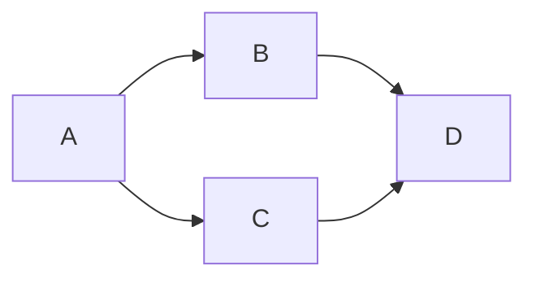

# DAG 与拓扑序预备

有向且无环，顶点就可以排成一条线，使得每条边都从左指向右；有环则不存在这样的序。

<footer>—— 据 Cormen, Leiserson, Rivest and Stein, Introduction to Algorithms；Kahn, Topological Sorting of Large Networks, CACM 1962 整理</footer>

[上一课](/cs/csr-graph)把默认图写成稀疏邻接。[图的定义](/cs/graph-definition)含有向边。[树作为无环连通图](/cs/tree-as-acyclic)的无环是无向的。本课不重讲 CSR。缺口是有向无环图（DAG）作为表示：边表达依赖，且依赖不许成环，从而存在线性扩展——拓扑序。本课只预备「存在性与等价」，真正的 BFS/DFS 算法在算法课程才跑。数据结构课在此结束。

## 问题

任务 $A$ 必须先于 $B$，画成 $A\to B$。若出现环，没有一种顺序能尊重全部边。缺口不是再选一种邻接格式，而是**把「可线性化的依赖」钉成 DAG 性质**：有向图无环 $\Leftrightarrow$ 存在拓扑序。表示仍用邻接表；额外不变式是无环。

入度数组是 Kahn 算法的零件：反复取入度为 0 的点。本课交代序的含义，不把循环不变式写完——那是下一课程第一课。

编译的依赖、Makefile、指令调度的数据依赖，都是 DAG。流水线 RAW 也是依赖边；硬件用转发，软件调度用拓扑。

## 方法

检测环：若拓扑过程结束后仍有未输出顶点，则剩下的点都在环里（或由环可达）。表示层可选择拒绝插入成环的边：插入前 `find` 依赖闭包——那太贵；通常建完再检。

上图一条拓扑序是 $A,B,C,D$ 或 $A,C,B,D$。邻接表存储与一般有向图相同；稀疏假设仍然适用。

## 机制

有了拓扑序，动态规划在 DAG 上按序推才合法：子问题沿边指向已经算完。那是算法课。本课交出对象：稀疏有向无环 + 存在线性扩展。并查集不能代替：它无向且不管方向。

与调用栈：递归依赖若成环会无限递归；DAG 保证递归依赖可终止——同一无环思想，对象从栈帧换成顶点。

## 边界

本课不运行 DFS 打时间戳，不证明白-灰-黑。不引入最短路。权可放在边上，本课不解释松弛。循环不变式课会把「已输出集合」写成归纳断言，那时才算算法开始。

后课默认：依赖图画成 DAG，邻接表已备好；正确性论证从循环不变式起，不再从「图是什么」起。

## 小结

- DAG = 有向无环；等价于存在拓扑序。
- 表示仍是稀疏邻接；无环是额外不变式。
- 数据结构课结束；下一课用不变式给循环证明。
- 出处：Kahn, *CACM*, 1962；Cormen et al. 拓扑排序预备。
