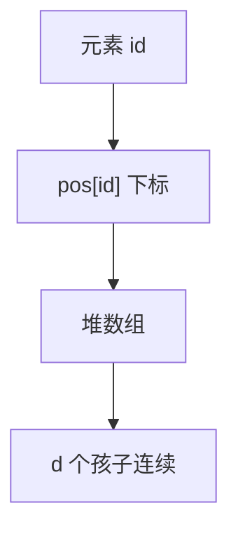

# d 叉堆与索引堆

每个节点 $d$ 个孩子，树更矮，下滤比较次数变多；再存从元素到下标的句柄，decrease-key 才不必先扫全表。

<footer>—— 据 Johnson, Priority Queues with Update and Finding Minimum Spanning Trees, 1975；Cormen, Leiserson, Rivest and Stein 整理</footer>

[上一课](/cs/heap-priority)钉了二叉堆：完全树、数组下标 $2i,2i+1$、insert/extract-min 为 $\Theta(\log n)$，并声明 decrease-key 需要句柄、$d$ 叉不在那一课。本课不重讲堆序。缺口是两个实现参数：扇出 $d$ 改变高度与下滤代价；索引（句柄）让「已知元素降键」真正 $\Theta(d\log_d n)$。散列课马上要另一条 $O(1)$ 期望查找，对象不同。

## 问题

二叉下滤每层比两个孩子。$d$ 叉：孩子是 $di+1,\ldots,di+d$，高度 $\Theta(\log_d n)=\Theta(\log n/\log d)$，insert 上滤更快，extract-min 每层要在 $d$ 个孩子里找最小。Johnson 用它调最短路里堆的常数。缺口不是斐波那契堆，而是**同一套堆序下改扇出**。

无句柄的 decrease-key 要先找到元素，$\Theta(n)$，堆的对数没有意义。索引堆：`pos[id]` 存堆数组下标，交换时两边更新。

$d=4$ 在 cache 行上有时更好：一层孩子更连续。过大则下滤的线性扫吃掉高度收益。

## 方法

数组表示不变，只改父子公式。上滤与父比；下滤在 $d$ 个孩子中取最小再比。索引：对外 id 稳定，对内下标变；`swap` 必须维护 `pos`。

建堆仍可自底向上 $\Theta(n)$：每层工作与 $d$ 有关，渐近仍线性。

## 机制

Dijkstra 一类反复 decrease-key 的算法，合同必须提供句柄。二叉够用时不必上 $d$；只有剖析显示 extract 与 insert 比例极端，才调 $d$。这是常数与 cache 的事，不是新 ADT。

与 B+ 对照：堆不支持高效任意键查找与中序。索引只映射「已知 id」，不是字典。字典是下一课散列或回到树。

## 边界

本课不引入二项堆、斐波那契摊还，不把操作系统就绪队列绑死为 $d$ 叉。也不把 `pos` 数组写成必须全局 $n$ 大——可用卫星指针反指堆槽。

后课默认：优先队列可以是二叉或 $d$ 叉，decrease-key 靠句柄。无序键的期望常数查找靠散列函数。

## 小结

- $d$ 叉降低高度、加重每层比较；数组公式改孩子跨度。
- 索引堆维护 id→下标，decrease-key 才对数。
- 任意键期望 $O(1)$ 是下一课 $h(k)$，不是堆。
- 出处：Williams, *CACM*, 1964（二叉）；Johnson, 1975；Cormen et al. 第 6 章。
