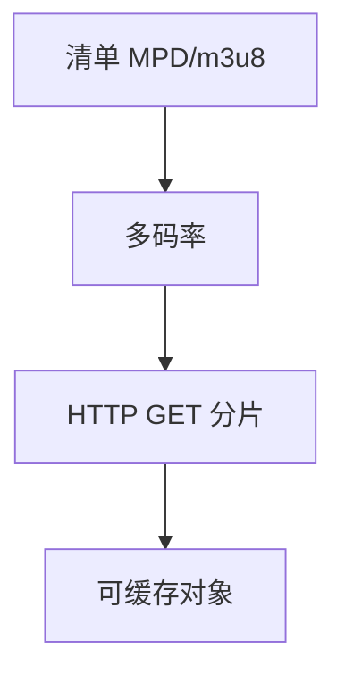

# DASH / HLS

把视频切成片段，用清单列出多码率 URL；播放器用 HTTP GET 拉片，中间是普通缓存，而不是一条永不结束的媒体 TCP。

<footer>—— 据 ISO/IEC 23009 DASH；RFC 8216 HLS 整理</footer>

[HTTP](/cs/http) 与 [CDN](/cs/cdn-intuition) 已能缓存 GET。[上一课](/cs/stun-turn) 是实时通话。缺口是**点播/直播切片**：MPD/m3u8、分片、与 WebRTC 对照。本课不把 ABR 算法写完。

## 问题

RTSP/RTP 难穿缓存与企业代理。DASH/HLS：编码多个 bitrate 的短文件（2–10 s），清单描述时间线。播放器按清单 GET，CDN 当静态对象。直播把清单滑窗。与 SSE：都是 HTTP，SSE 是事件，这里是媒体文件。H3 可拉片，0-RTT 适合幂等 GET。

不要把切片写成 MPEG 压缩课。

HLS RFC 8216。DASH 是 ISO。本课钉分发，不钉编码器。

### 清单加 HTTP 分片

CDN 当静态对象缓存。直播滑窗。延迟由分片时长与缓冲决定，不是物理传播。Progressive 单文件失去 ABR。

## 方法

画：清单 → 选表示 → GET 分片。对照 WebRTC 推流。与巨帧无关直接；分片大小影响请求率和 ABR。

方法止于选定对象与对照；机制才说它如何嵌入已有分层与主干课。

## 机制

GeoDNS 找近边缘。Cookie 可用于鉴权 URL。队头：H1 多连接拉片；H2 多流。PMTUD 影响分片下载。DRM 在分片上，点名。

直播延迟 ≈ 分片时长 × 缓冲片数，不是卫星那种物理。

## 边界

本课不引入 CMAF 的全部。ABR 自适应码率是下一课。后课默认：自适应流 = 清单 + HTTP 分片 + 缓存。

把整部电影当一个文件 Progressive Download 失去 ABR 与缓存粒度。

上一课留下的缺口在本课收口；「DASH / HLS」进入后课词汇表后只引用。文献用来钉对象与边界，不把本课写成该主题的独立综述。下一课[ABR 自适应码率](/cs/abr-streaming)。

## 小结

- 分片 + 清单，走标准 HTTP。
- CDN 友好；直播滑窗清单。
- 延迟由分片和缓冲策略决定。
- 后课只引用本课钉死的对象，不从该领域总问题重开。
- 出处：ISO DASH；RFC 8216。
