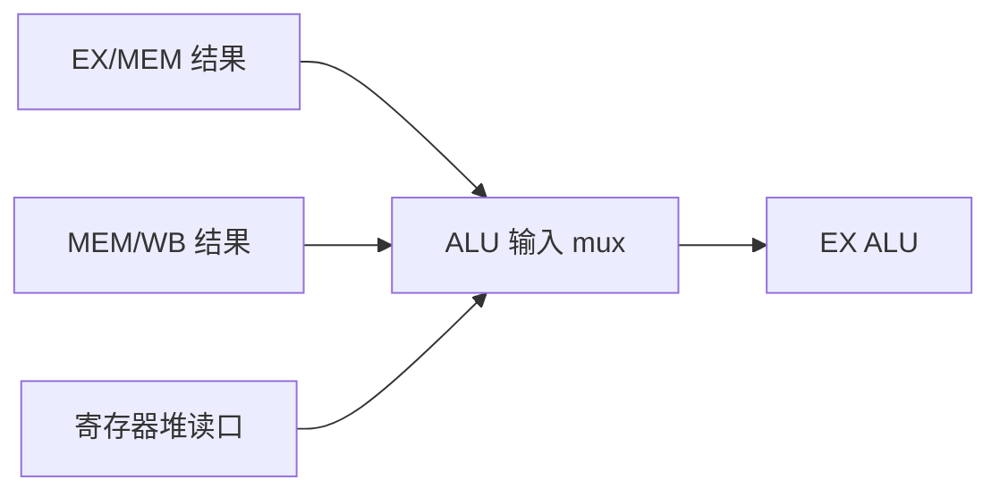

# 数据冒险与转发

后指令要的操作数，可能还停在前指令的流水线寄存器里；从那里抄过来，不必等写回。

<footer>—— 据 Patterson and Hennessy, Computer Organization and Design (RISC-V) 整理</footer>

[上一课](/cs/structural-hazard)用分体存储和两读一写堆拿掉了结构冲突。本课不重讲端口日历。缺口是：即使硬件够用，后一条指令在 ID 读寄存器时，前一条的结果可能还在 EX 或 MEM，堆里仍是旧值。本课只处理这类数据冒险，并用转发把结果从级间寄存器送到 ALU 输入。

## 问题

`add x1, x2, x3` 后面紧跟 `sub x4, x1, x5`。按五级时间表，`add` 在 WB 才写入 `x1`，`sub` 早两拍就在 ID 读堆。读到的是旧 `x1`，ISA 的顺序语义被打破。缺口不是再加一个 ALU，而是承认**流水线里存在尚未写回的「未来寄存器值」**，必须在 ALU 使用前接到正确来源。

load 更苛刻：数据要到 MEM 结束才出现，下一条若在 EX 就要用，转发也来不及，必须停一拍。本课把这条 load-use 停顿钉死，不把停顿推广到所有相关。

相关按读写分类：RAW 是真依赖，WAR/WAW 在五级顺序流水线里几乎不出现，因为写固定在 WB、读在 ID。乱序核里它们会回来。

## 方法

比较 EX/MEM 与 MEM/WB 流水线寄存器中的目的寄存器号，与当前 EX 级指令的源寄存器号。若匹配且前指令确实要写寄存器，把 ALU 或存储器刚得到的值 mux 进 ALU 输入，而不是用堆读出口。这就是转发（旁路）。

load 后紧跟使用：转发源在 MEM，使用者已进入 EX，路径差一拍。检测 load-use，在 ID/EX 插入气泡，让 load 先走到 MEM，下一拍再转发。

## 机制

转发恢复的是 ISA 看见的 RAW 顺序，不改变五级划分。编译器仍可插入无关指令填 load-use 槽，那是软件调度；硬件必须在任意指令对上正确。控制冒险尚未进场：本课假定 PC 顺序加 4。

检测逻辑是组合比较器加 mux 选择，延迟加在 EX 前。设计若把时钟再压紧，转发路径会成为新的关键路径；那是实现约束，不是语义缺口。

## 边界

本课不处理分支用到的条件与目标——它们在 EX 才齐，属于[控制冒险与分支预测](/cs/control-hazard-predict)。也不引入寄存器重命名：五级里 WAR/WAW 被固定写回点挡住。浮点多周期运算的相关，后课 Tomasulo 才系统处理。

后课默认：整数 ALU 相关用转发消除；load-use 仍可能停一拍。谈到「数据冒险」，先指 RAW。

## 小结

- 数据冒险是后指令要用的值还在流水线里，堆尚未更新。
- 转发从 EX/MEM、MEM/WB 旁路到 ALU；load-use 仍要一拍气泡。
- 控制相关是后课的缺口。
- 出处：Patterson and Hennessy, *COD* RISC-V 数据冒险与转发。
