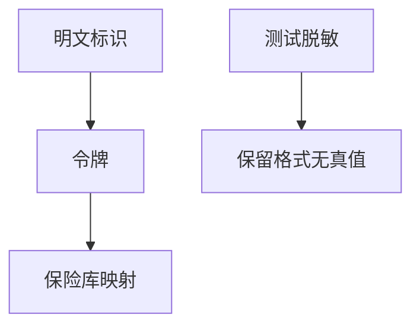

# 脱敏与令牌化

脱敏把生产数据变成测试可用的形状；令牌化用随机替代值换掉主键，真值放进保险库。二者减少明文扩散，但不能把弱访问控制补成强。

<footer>—— 据 NIST 对去标识化的讨论；PCI DSS 对令牌化的实践陈述；对照 GDPR 最小化</footer>

## 定位

上一课[GDPR](/cs/gdpr-technical)要最小化。缺口是**工程手段**：掩码、令牌、保险库。本课分工，不把脱敏当 DP。

后课默认已经读完本课钉下的合同，只补差，不从该领域第一性原理重开。

## 问题

测试环境拷生产库。缺口：格式保留 vs 随机令牌、保险库 ACL、不可逆哈希盐（回口令课）。

### 可逆

可逆令牌化的保险库是新 TCB，等于又一个密钥管理系统。

PCI DSS 令牌化指南。MPC 下一课让计算不必集中明文。

## 方法

对照静态脱敏与动态。下一课 MPC 应用。

图中节点是本课的机制骨架；课程不把图展开成可运行的攻击步骤。

## 机制

减少持有。MPC 下一课连计算都不集中。

前提写进合同之后，游戏外的误用只当失败模式点名，不在本课写成操作程序。

## 边界

不写再识别。MPC 应用下一课。

## 小结

- 法律要最小化；令牌化减少明文副本。
- 保险库是新 TCB。
- 脱敏不是差分隐私。
- 下一课 MPC 应用。
- 出处：PCI DSS 令牌化；NIST 去标识化讨论。
