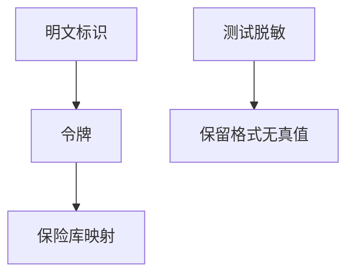

# 脱敏与令牌化

脱敏把生产数据变成测试可用的形状；令牌化用随机替代值换掉主键，真值放进保险库。二者减少明文扩散，但不能把弱访问控制补成强。

<footer>—— 据 NIST 对去标识化的讨论；PCI DSS 对令牌化的实践陈述；对照 GDPR 最小化</footer>

## 定位

上一课[GDPR](/cs/gdpr-technical)要最小化。缺口是**工程手段**：掩码、令牌、保险库。本课分工，不把脱敏当 DP。

后课默认已经读完本课钉下的合同，只补差，不从该领域第一性原理重开。

## 问题

测试环境拷生产库是最常见的明文扩散：开发机、笔记本、外包各落一份副本，数据一出受控库，访问控制与审计跟着失效。子集抽取比全量脱敏便宜，但外键要在切片内保持一致，否则测试数据自相矛盾。缺口：格式保留 vs 随机令牌、保险库 ACL、不可逆哈希盐（回口令课）。

### 可逆

可逆令牌化的保险库是新 TCB，等于又一个密钥管理系统：主密钥在 HSM 或密钥服务，映射表自身要加密、审计、按用途限权；保险库打穿等价全部明文失守。静态脱敏在数据出口一次性变换；动态脱敏在查询路径按角色实时重写，代价是查询延迟与策略维护面。

PCI DSS 令牌化指南。MPC 下一课让计算不必集中明文。确定性变换泄露相等性：同值同码即可做频率分析；FPE（NIST SP 800-38G）保格式仍属确定性替换。

## 方法

选型按用途：测试要保形——类型、长度、引用完整；令牌化要保可逆与可联结。PAN 令牌常保留 BIN 与尾四位，校验位仍过 Luhn。跨环境联结用带密钥的 HMAC-SHA-256 替代裸哈希：无钥者建不了字典反查。令牌用密码学随机（128 位 UUID 或加密计数器），不用可枚举序号——枚举令牌让越界方按序反推总量。不可逆脱敏破坏联结与统计性质，聚合口径要事先定。下一课 MPC 应用。

```mermaid
flowchart TD
  PII["明文标识"] --> TOK["令牌"]
  TOK --> VAULT["保险库映射"]
  MASK["测试脱敏"] --> SHAPE["保留格式无真值"]
```

图中节点是本课的机制骨架；课程不把图展开成可运行的攻击步骤。

## 机制

机制是缩小敏感数据的暴露集：真值副本从 N 份降到 1 份（保险库），其余位置只有令牌，越界数据的价值随可联结性下降。失败模式：可逆性失控（保险库权限过宽）、确定性泄露相等性、脱敏字段的组合仍可再识别——回到 [k-匿名](/cs/k-anonymity) 的维度攻击。与差分隐私的分界：脱敏是集合缩小，DP 对查询结果本身加噪并给出 $\varepsilon$ 保证；GDPR 下假名化数据仍是个人数据，匿名化才是出列，判例从严。MPC 下一课连计算都不集中。

前提写进合同之后，游戏外的误用只当失败模式点名，不在本课写成操作程序。

## 边界

不写再识别。不把脱敏报表当成匿名化结论。MPC 应用下一课。

## 小结

- 法律要最小化；令牌化减少明文副本。
- 保险库是新 TCB。
- 脱敏不是差分隐私。
- 下一课 MPC 应用。
- 出处：PCI DSS 令牌化；NIST 去标识化讨论。
