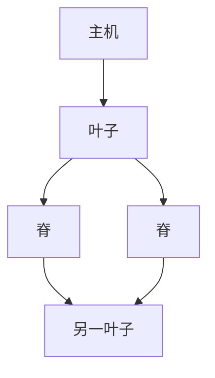

# 数据中心 Clos / 胖树

叶子–脊线全互联把东西向带宽做成多级 Clos；ECMP 把流洒在多条等代价边上，取代大二层生成树。

<footer>—— 据 Clos, A Study of Non-blocking Switching Networks, BSTJ 1953；Al-Fares et al., SIGCOMM 2008 胖树整理</footer>

[交换机 HOL](/cs/output-queue-hol) 与 [ECMP](/cs/ecmp-hashing) 已备好。[上一课](/cs/p4-programmable) 不改拓扑。缺口是**数据中心怎么连**：leaf-spine、过订购比、L3 到叶子。本课不把 incast 扇入写完。

## 问题

接入–汇聚–核心树在东西向拥挤，STP 还要阻塞边。胖树/Clos：每叶子连所有脊，脊再可选超脊。带宽由「叶子上联数 × 口速」决定，过订购是刻意的经济。转发：每叶子一个子网，主机默认网关在叶子（IRB/EVPN），中间纯 L3 ECMP，无 STP 大域。VXLAN 覆盖跑在这张 IP 网上。

不要把 Clos 写成无阻塞的数学保证：流量矩阵一偏，脊仍可满。

Clos 原是电话交叉。Al-Fares 把胖树搬到以太网。本课不点名某云的内部名。

### 东西向用 ECMP

leaf-spine 多条等代价，大 STP 退出。过订购是经济，流量一偏脊仍满。故障重哈希会短暂乱序。

## 方法

画：leaf 与 spine 全网格。对照校园三层：这里每跳都 ECMP。LACP 可把多口当一条上联，但叶子到脊更常用独立 ECMP 边。

方法止于选定对象与对照；机制才说它如何嵌入已有分层与主干课。

## 机制

TE 在数据中心常简化为 ECMP + 尽量对称布线；极化仍在。BGP 可作 IGP（每盒一个 ASN 或私有 AS），收敛与策略比 OSPF 更熟——这是运营选择。5G 核心 UPF 也可落在 Clos 上，无线切片不改机房拓扑。

故障：一条脊挂了，哈希重映射，短暂乱序，与 LACP 成员 down 同类。

## 边界

本课不引入 Jupiter 一类专有细节。incast 是下一课。后课默认：东西向用 Clos + L3 ECMP，大 STP 退出。

光模块与 100G lane 决定实际能铺多少脊。

上一课留下的缺口在本课收口；「数据中心 Clos / 胖树」进入后课词汇表后只引用。文献用来钉对象与边界，不把本课写成该主题的独立综述。下一课[incast](/cs/incast)。

## 小结

- leaf-spine Clos 提供多条等代价东西向路径。
- 过订购是容量规划，不是协议字段。
- 用 ECMP 替代阻塞冗余边。
- 后课只引用本课钉死的对象，不从该领域总问题重开。
- 出处：Clos, 1953；Al-Fares et al., 2008。
