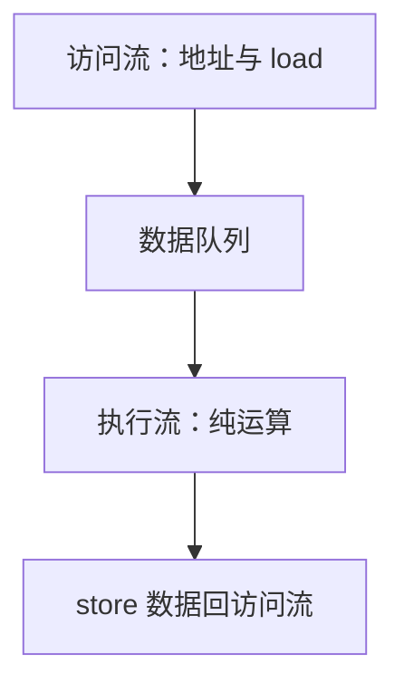

# 数据流与解耦访存执行

指令何时执行由操作数到齐决定，而不是由 PC；解耦架构把产生地址的那条流与消耗数据的那条流拆开，用队列吸收缺失。

<footer>—— 据 Dennis 的数据流；Smith, Decoupled Access/Execute Architectures, ISCA 1982 整理</footer>

[上一课](/cs/vliw-epic) 仍按 PC（或 bundle）推进。[Tomasulo](/cs/tomasulo) 已经在乱序核里用标签做局部数据流。本课不重打包 VLIW。缺口是 **数据驱动的执行，以及 DAE：访问处理器与执行处理器之间用架构可见的队列解耦。**

## 问题

PC 驱动：下一条是内存里的下一字，即使它的数据还没到。[MLP](/cs/mlp-memory-parallelism) 依赖乱序窗口碰巧装得下未来的 load。数据流机：点火规则是「token 齐」，理论上只剩真相关。缺口不是再宽的 bundle，而是**把「算地址」与「用数据」拆成两条流，中间 FIFO 在 cache miss 时让执行侧继续做已到的运算，访问侧继续甩 load。**

Smith 的 DAE：两个 PC、两套指令，编译器保证队列配对。它比纯数据流现实：控制流仍在，只是访存延迟被队列吸收。

## 方法

纯数据流：指令存图，匹配单元等 token，齐则点火，结果再当 token 发出。DAE：Access 核跑 load/store 与归纳变量，Execute 核跑纯运算；队列满/空则停相应一侧。当代乱序核的 LQ 与 IQ 是同一思想的微结构版，但 ISA 仍是单一 PC。

## 机制

这解释了为何乱序核要那么大的 LQ：它在模拟 DAE 的队列，而不改 ISA。VLIW 缺这个队列时，一记 miss 停整束。GPU 用大量 warp 换同一目的：延迟隐藏靠切换线程，不是数据流点火。

本栏不把数据流图写成 ML 的 autograd 图。

## 边界

本课不设计完整的 tagged-token 数据流 OS。下一课向量：回到 SIMD 格子，用 lane 同时对一组元素点火，控制流仍是一条。

后课默认：延迟可以用窗口、队列或线程切换来藏。规则数组上，一条指令覆盖多 lane 比 MIMD 更密。

## 小结

- 数据流按 token 点火；DAE 用双流队列吸收访存延迟。
- 乱序 LQ 是单 ISA 下的 DAE 近似。
- 向量 lane 把 SIMD 铺成硬件数据通路，下一课。
- 出处：Dennis；Smith, *ISCA*, 1982。
