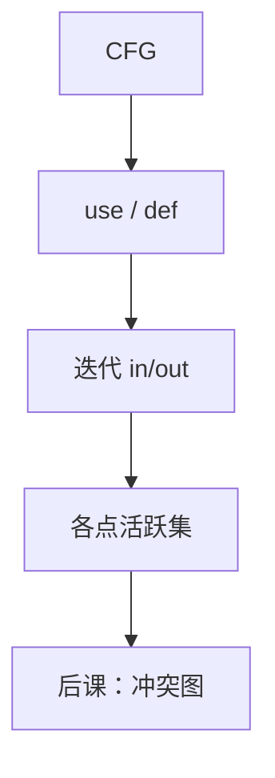

# 活跃变量与数据流

变量在某点活跃，当存在从该点出发的路径会在重写前读它；这是向后的数据流。

<footer>—— 据龙书第 8、9 章整理</footer>

上一课[支配与 φ](/cs/dominator-phi)让标量定值唯一，但寄存器分配仍要知道**区间是否重叠**。本课不重插 φ。缺口是：一般数据流框架，并以活跃变量为实例——后向、并汇合。指令选择还没开始；本课的对象仍是 IR 名字。

## 问题

临时太多，物理寄存器少。若两名字同时活跃，它们冲突，不能占同一寄存器。缺口是计算每条指令处的 `in/out` 活跃集。方程：`out[B]=\bigcup_{后继} in[S]`，`in[B]=use[B]\cup(out[B]-def[B])`。迭代到不动点。CFG 有环，故要迭代，不像 DAG 上一次 DP。

SSA 上活跃仍可算，区间更干净。本课方程对非 SSA 也成立，覆盖更广。

### 数据流不是「再跑一遍 BFS」

BFS 求无权距离；数据流是格上的不动点：子集格、并或交、单调函数。到达定值向前；可用表达式另一套 gen/kill。本课用活跃代表后向，不把所有分析写成词条。

龙书第 9 章数据流框架：单调性保证从空或全开始迭代收敛。Kildall 早期工作点名即可。寄存器分配下一课用冲突图吃本课的活跃。

## 方法

对每个基本块算 `use`/`def`。倒序或轮询块，更新 `in/out` 直至不变。指令级可再细拆。复杂度多项式：集的大小 $\times$ 块数 $\times$ 迭代（深度相关）。

[循环不变式](/cs/loop-invariant)分析正确性；这里的不变式是「当前解低估或高估活跃」，单调逼近不动点。

## 机制

死赋值：`def` 的名字不在 `out` 则可删（无副作用）。下一课冲突图：边连接同时活跃的名字。[NPC](/cs/npc-canonical) 课已说着色难；本课只供图。SSA 的 φ 在块首：活跃从后继回传时要按前驱拆，实现细节点名。

## 边界

本课不着色、不选指令、不做别名分析（指针使 `use` 不精确，保守当全活跃）。常量传播是另一套格。后课默认：能算出 IR 名字的活跃。指令选择把 IR 运算变成机器指令模板。

## 小结

- 活跃 = 向后数据流；`use`/`def` 迭代到不动点。
- 同时活跃 ⇒ 寄存器冲突。
- 框架可换到达定值等；本课只钉活跃。
- 出处：Aho et al., 龙书第 8–9 章。
