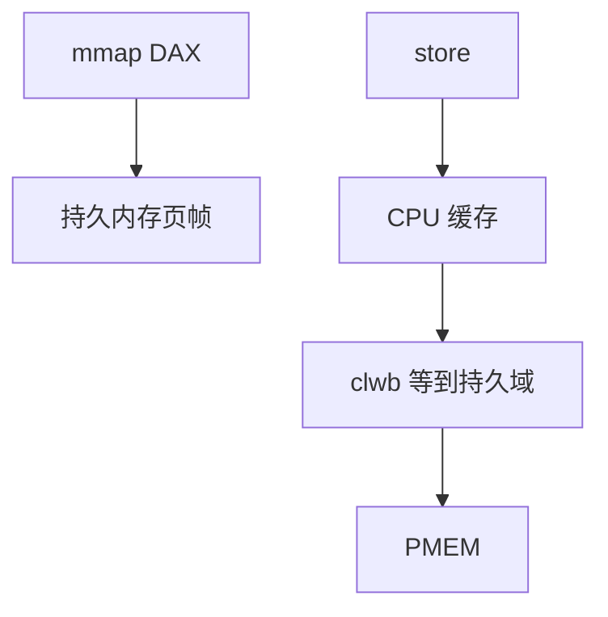

# DAX 与持久内存

DAX 让文件系统把持久内存页直接映进用户地址空间：load/store 代替 read/write，但持久顺序要靠刷写指令，而不是块层 flush。

<footer>—— 据 Linux DAX 文档；Intel 对持久内存编程模型的说明；Rudoff 对 SNIA NVM 编程的整理</footer>

[上一课](/cs/bcache)仍是块 I/O。[mmap](/cs/fs-mmap-coherence) 通常缺页从块设备填 DRAM。[NVMe](/cs/nvme-driver) 再快也是完成队列。缺口是 **持久内存 + DAX**：介质可字节寻址，页缓存变成可选。

## 问题

PMEM（或 CXL 内存的持久部分）出现在物理地址。FS（ext4/xfs dax、NOVA 等）可把文件映射到这些页，`MAP_SYNC` 等语义要求 store 到达持久点。缺口：CPU 缓存里的脏行不是持久的，需 `clwb`/`sfence` 或 `msync`；与 [O_DIRECT](/cs/direct-io) 不同——没有 bio；与 tmpfs 不同——掉电还在（若刷对）。本课不把每一代 Optane 产品当目录。

falloc 预分配在 DAX 上仍占介质。错误 DRAM 与 PMEM 混映射会把易失当持久。教学对象是「绕过块层的 mmap」。

## 方法

挂载 `dax`：`mmap` 建立直接映射，fault 填物理 PMEM pfn。`read`/`write` 仍可走拷贝路径或短期缓冲。崩溃一致：应用或库（PMDK）按失败原子粒度刷。对照 [COW FS](/cs/cow-filesystem)：仍可在 PMEM 上 COW，只是拷贝是 `memcpy` 加刷写。对照块设备：没有 mq-deadline。

## 机制

DAX 把存储栈变短：FS 负责分配与元数据，数据路径像内存。正确性从「bio 完成」换成「持久域可见性」，这是新的编程模型。不要把它写成量化超低延迟撮合。内核仍要管坏页、热插、fsck。

与加密：dm-crypt 在块层，DAX 常绕过它，需 FS 级或硬件加密。

实现上：CPU 缓存行刷到持久域的指令因平台而异，库（PMDK）把这封装成粒度。混合 DRAM 缓存的 FSDAX 若崩溃，DRAM 里那一层不是持久的。 读法上只引用[上一课](/cs/bcache)的结论，不把对象换成训练推理或限价簿。

本课在操作系统进阶的「存储栈 / 块层到设备」课序里，对象是 **DAX 与持久内存**。

- 先修只引用，不重导：上一课的结论当公理，本课只补差。
- 五栏不吞并：不把本课写成大模型训练/推理，也不写成限价簿或权重量化。
- 文献用 OSTEP、McKusick、内核文档与具名会议论文；不发明 arXiv 编号。

## 边界

本课不引入所有 `pmem` 命名空间模式（fsdax vs devdax）。不保证每个平台的持久域边界文档一致。下一课回到块设备，但完成等待换成轮询：io polling。

版本字段会变，课序钉的是机制对象「DAX 与持久内存」，不是某一主线内核的结构体名。
后课默认：PMEM 文件可 DAX 映射，持久靠刷写。块层用轮询代替中断收完成，下一课。

## 小结

- DAX 把 PMEM 映进页表，绕过块层数据路径。
- 持久顺序是 CPU 刷写，不是 NVMe 完成。
- 轮询 I/O 是下一课。
- 出处：Linux DAX；SNIA NVM 模型；ext4/xfs dax 文档。
