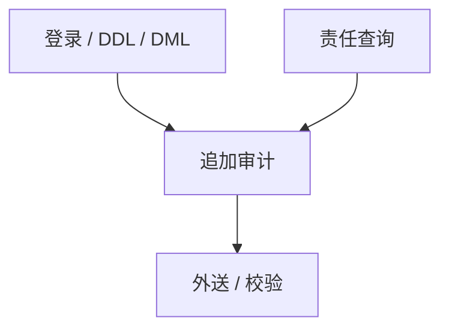

# 数据库审计

授权决定能不能做；审计决定事后能否证明谁做了。没有不可抵赖的日志，RLS 与 GRANT 只是当前状态。

<footer>—— 据数据库审计与合规实践；Gray 对事务日志作为真相来源的讨论对照</footer>

[上一课](/cs/row-level-security)把行滤进计划。缺口是**责任**：谁在何时读了或改了哪一行。本课收束「数据库进阶」。下一课程分布式从 [故障模型](/cs/failure-models) 起，审计日志不是共识，但共识课要假定有可查的历史。

## 问题

WAL 服务崩溃恢复，不一定服务「谁 SELECT 了身份证」。审计：DDL/DML/登录、可选的列级读。缺口是性能与完整性：同步审计拖事务；异步会丢。日志必须防篡改（追加、校验、外送）。与 RLS：管理员绕过更要记。与 Jepsen：对抗测试不替代生产审计。

合规（谁访问了个人数据）与性能剖析不是同一份日志。混用会要么太重，要么太不可读。

## 方法

定义对象：登录、DDL、对敏感表的 DML、策略绕过。存储：独立卷或外部 SIEM，保留期。查询：按主体、对象、时间。测试：关掉审计应报警。与湖仓：表格式的提交日志是写审计，读审计仍要引擎配合。

## 机制

审计是另一条只追加的真实来源，与 WAL 并行。若与 WAL 同一磁盘、同一超级用户，崩溃恢复成功仍能毁证据。哈希链或外送使删改可被发现。同步审计进组提交路径会拖 D；异步会丢最后窗口——又一个持久性等级。体积：全 SELECT 审计在 OLAP 扫上等于再写一份元数据，要采样或只记对象。语句文本可能含敏感字面量，要脱敏。

保存点部分回滚仍可能已记下失败语句。存储过程记 CALL 还是展开内部 SQL，粒度要选。TPC 跑分通常关审计，报告须声明。读审计本身也要 RLS。

## 边界

本课不写某司法辖区条文。数据库进阶在此封口：SQL、依赖、优化、执行、存储、事务、分布式、模型族、分析与流、对抗与授权。下一课程按大纲接分布式系统（故障模型等）。不要把审计当加密或当 WAL。

后课默认：事中 RLS、事后审计、底层 WAL/TDE。WAL 让你恢复数据；审计让你解释谁碰过数据。

## 小结

- 审计补上授权没有的时间轴与不可抵赖。
- 必须与 WAL 分失败域，并防篡改。
- 数据库进阶封口；下一课按大纲接分布式系统。
- 出处：数据库审计实践；Gray 对日志作为真相来源的讨论。
