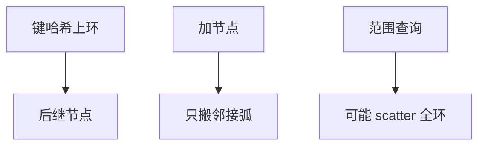

# 一致性哈希在数据库

节点与键放在环上，加节点只搬邻居区间。虚拟节点把负载摊匀。数据库用它当分片函数，仍要处理范围查询与事务。

<footer>—— 据 Karger et al. consistent hashing；计算机栏一致性哈希课接到分片；Cassandra</footer>

[上一课](/cs/distributed-deadlock)处理跨节点等待。本课不 probe。缺口是再平衡搬家量：模 $N$ 哈希在 $N{+}1$ 时几乎全搬。一致性哈希（consistent hashing）让加删节点只影响环上相邻键。计算机课已有 [一致性哈希](/cs/consistent-hashing)；数据库进阶接到副本、虚节点、与范围分片对照。

## 问题

环：节点哈希到圆，键顺时针找后继。虚拟节点：每物理机多个点，改善均匀。缺口是 **SQL 范围**：环打散键则 `BETWEEN` 打全体节点，与范围分片相反。事务：跨相邻虚节点仍可能跨物理机。副本：后继 $R$ 个节点存副本，故障沿环走——与 Paxos 组划分不同。

再平衡：新节点从后继偷走一段，拷贝时双路由，同再平衡课。

Karger et al. 一致性哈希（DHT 谱系）。Cassandra 令牌环是数据库著名实现。本课不重推哈希函数。

## 方法

选：写均匀、节点频繁进出 → 环。范围扫描、时间局部 → 范围分片。混合：先租户范围再租户内哈希。查询路由：协调器算令牌。二级索引仍头痛。

与缓冲：无关直接。与 LSM：各节点本地 LSM，环只定键归属。

## 机制

虚拟节点数少则不均匀，多则元数据大。一致性哈希不给外部一致，只给键放置。读己之写仍要会话。倾斜：热键仍打一点，要打散后缀或单独拆。

死锁：环不解决锁序。分片键课的热点病在环上变成单虚节点热。

## 边界

本课不比共享磁盘。也不把 DHT 动态成员当 Spanner 目录。RocksDB 是节点内引擎，后课。

后课默认：均匀写可用令牌环；范围查询慎用。无共享对共享存储：机器是否共用盘阵。

搬家量 $O(1/N)$ 是环的卖点，不是查询卖点。

## 小结

- 一致性哈希减加节点搬家；范围查询与事务不自动变好。
- 虚节点摊负载；热键仍要另拆。
- 无共享对共享存储下一课。
- 出处：Karger et al.；Cassandra；分片课。
