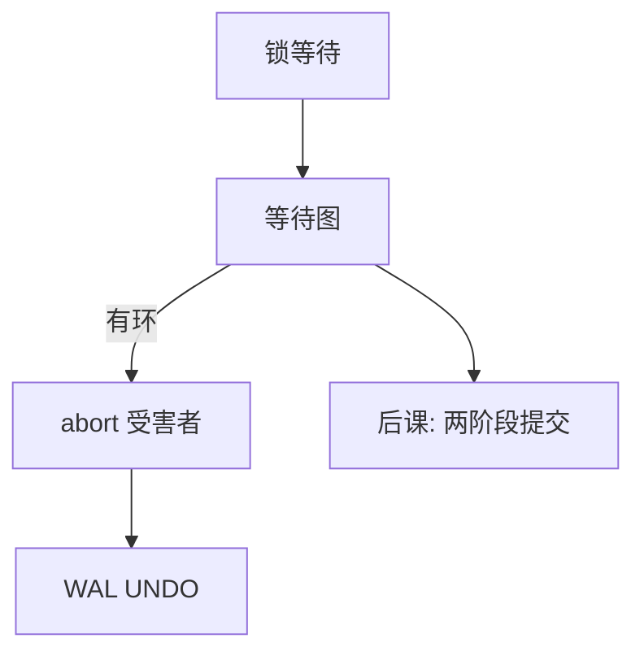

# 库内死锁

事务锁上的等待可以成环；库检测环并回滚其中一人，与操作系统的四条件同一结构、另一套对象。

<footer>—— 对照[死锁四个条件](/cs/deadlock-coffman)；Gray and Reuter 对等待图的整理</footer>

[上一课](/cs/isolation-levels)让事务为隔离而持锁或等待版本冲突。本课不重列异常名。[Coffman 四条件](/cs/isolation-levels)已在操作系统课钉过。缺口是：数据库的锁是数据项上的、可升级、可超时，等待图在锁管理器里，而不是进程对设备。库通常**检测并牺牲**，很少靠银行家算法预防。

## 问题

$T_1$ 持有 $x$ 等 $y$，$T_2$ 持有 $y$ 等 $x$，环出现。缺口不是再证四条件，而是把对象换成事务与锁：互斥（X）、占有并等待、不可抢占（一般不抢锁）、循环等待。检测：周期建等待图或在加边时判环。牺牲：abort 代价较小或年轻的事务，其 UNDO 走[ARIES](/cs/aries-recovery)。

闩锁（页内短锁）死锁由引擎自己保证无环或有固定顺序；事务死锁才进等待图。两者不要混成一句「数据库死锁」。

## 方法

等待图：顶点事务，边「等谁」。有环则选受害者。超时是粗糙检测，可能误杀慢事务。预防：按对象序加锁、wait-die / wound-wait 时间戳，应用难守全序，故引擎以检测为主。本课不把分布式死锁的幽灵边写完，只点名：两阶段提交等待也会跨节点成环。

## 机制

隔离级别影响环的频率：锁越长、粒度越粗，环越多。MVCC 减少读写等待，写写仍可环。受害者回滚释放锁，环断，其余前进；被牺牲者由应用重试，可能再次撞上热点——这是活锁边界，不是检测失败。

死锁不是完整性错误：约束仍成立，只是进度卡住。日志必须记下 abort，以免恢复把半成品重做提交。

## 边界

本课不把死锁当「锁用错了」的道德判断；可串行协议几乎必然允许等待。也不讲应用层的重试风暴治理。单对象无等待的 OCC 用中止换阻塞，死锁少、中止多，是另一权衡。

检测周期太长，吞吐先冻住；太短则空耗 CPU。这是参数，不是新协议。后课默认：单机锁死锁可检测；跨资源管理器的原子提交是另一协议，失败模式从环变成协调器阻塞。

牺牲者必须真的 abort 并释放，环才会断。只超时不 UNDO，等待图仍在。这与 OS 里杀进程同一结构。

## 小结
- 闩锁死锁由引擎内部顺序避免；事务死锁才进等待图，二者不要混名。
- 后课 2PC 的等待跨节点，检测图会变成分布式。

- 隔离带来等待；库内死锁 = 事务等待图成环，牺牲一人。
- 与 OS 四条件同构，对象是锁项，处理以检测为主。
- 跨库原子提交不能靠这一张等待图，入口是两阶段提交。
- 出处：Gray and Reuter；对照 Coffman et al.；Bernstein 并发控制。
