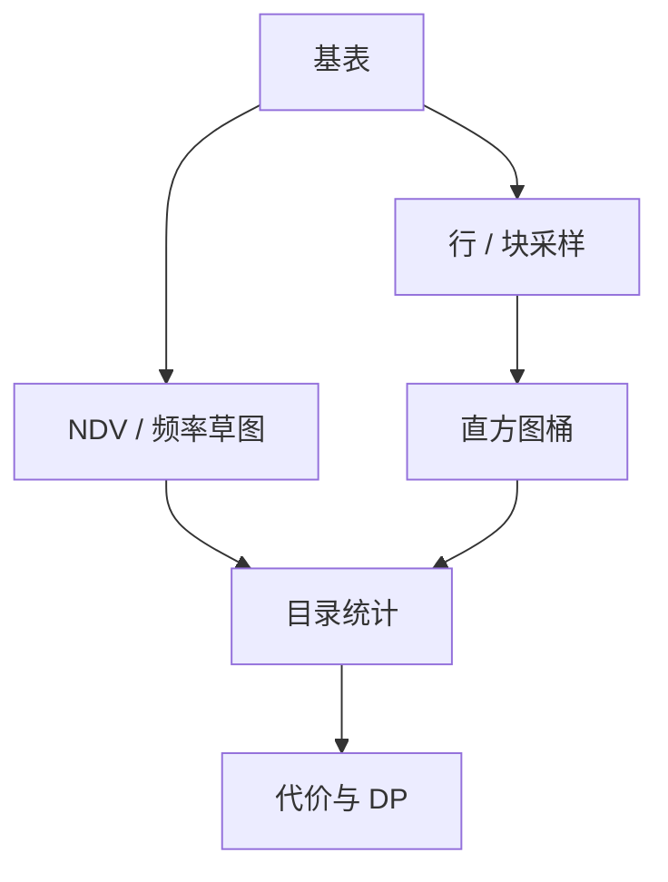

# 采样与草图统计

目录里的直方图会过期；采样与草图用可控误差再看一眼数据，给优化器另一份基数输入。

<footer>—— 据 Olken and Rotem 对数据库采样；Haas et al.；HyperLogLog 在 NDV；Ramakrishnan and Gehrke</footer>

[上一课](/cs/cardinality-error-propagation)指出独立假设连乘会炸。本课不重推误差公式。缺口是统计怎么来：全表扫描维护精确 NDV 太贵；过期 ANALYZE 比错误公式更常见。采样（行样本、块样本）与草图（概率结构）在精度、CPU、存储之间折中。

## 问题

`COUNT(DISTINCT)` 与连接 NDV 需要不同值个数。精确维护每个列每个组合不可能。缺口是估计器：均匀行采样在聚簇数据上偏倚；块采样便宜但方差大。草图：HyperLogLog 估 NDV，Count-Min 估频率，quantile sketch 估分位以建直方图。这些结构在计算机课已作为数据流出现；本课只把它们接到优化器目录。

动态采样：优化时扫一小份数据估当前谓词选择率，适合参数化查询与过期统计。代价是优化时间变长——与计划缓存的「跳过优化」相反。

Olken 的数据库采样综述。HLL 见 Flajolet et al.。本课不把草图当查询结果（近似查询另册），只当优化器输入。计算机栏的 HyperLogLog 课已有算法，这里不重推散列。

## 方法

ANALYZE：按块或行取样，建直方图、最频繁值、NULL 比例、NDV 草图。多列：对查询里常见列组维护联合统计或列组 NDV。动态采样：对单次查询的谓词在表上抽若干块。

样本大小决定置信：选择率极低的谓词（「选一个主键」）样本里可能零命中，要用平滑或改走索引统计。这是估计器偏差，不是存储 bug。

## 机制

统计是快照：写入一秒钟后样本过期。自动 ANALYZE 阈值（表改了百分之几）是工程。锁定计划的预编译语句在统计刷新后应失效——[计划缓存](/cs/prepared-plan-cache) 已要求。

草图有可合并性：分区表各分区一份 HLL，可并成全表 NDV，服务后课分区裁剪与全局估计。

## 边界

本课不校准代价公式里的随机 I/O 常数——下一课代价模型校准。也不把采样查询（`TABLESAMPLE`）的用户语义与优化器内部采样混成同一 API。近似聚合查询是分析课，不是优化器统计。

后课默认：统计来自样本与草图，带误差条；极低选择率不要信样本零命中。校准课把「模型常数」与「基数输入」分开调。

优化器读的是摘要，不是每次优化全表。

## 小结

- 采样与草图维护 NDV、频率、直方图，误差可控但非零。
- 动态采样用优化时间换较新的选择率。
- 代价模型校准下一课：同样基数下，I/O 与 CPU 权重仍可能错。
- 出处：Olken and Rotem；Haas 等；Flajolet 等 HLL；Ramakrishnan and Gehrke。
