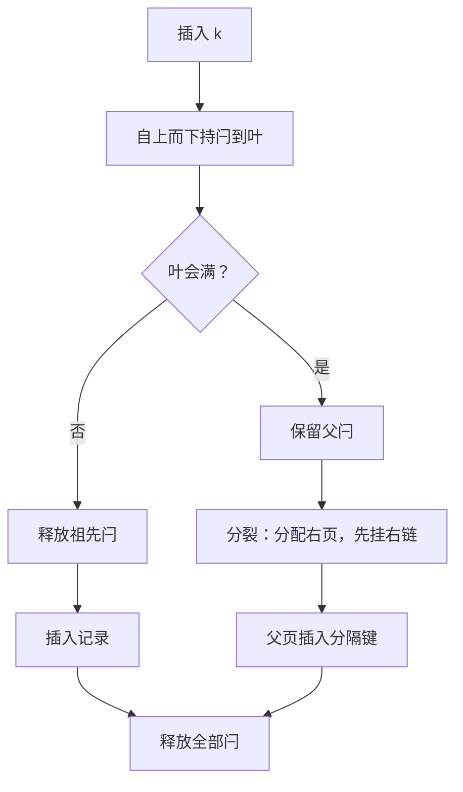

# B+ 树的并发控制

读者可以走一棵正在被改写的树，条件是作者每次只动一页，并且先把新页挂到读者看得见的地方。

<footer>—— 据 Lehman and Yao, ACM TODS, 1981；Mohan, ARIES/IM, SIGMOD 1990 整理</footer>

[上一课](/cs/dbk-pages-bufferpool)把缓冲池立成契约：fix 页、持 pin、不许持闩做 I/O。缺口立刻出现：索引不是一页，是一棵树；一次探测要串起好几页，一次插入还可能改结构。主干 [latch crabbing](/cs/latch-crabbing) 已给了读协议（逐层蟹行、读最多同持两层）与 B-link 的乐观读法；本课写实现侧剩下的硬骨头——结构变更（分裂、合并）期间闩按什么序拿、按什么序放，读者怎么发现「叶页在我脚下换了」。

## 问题

蟹行协议在「只改一行、不改结构」时够用；插入一旦触发[分裂](/cs/bplus-split)，实现必须回答三个次序问题：新叶页先挂右链还是先挂父指针？父页的闩何时拿、持有到何时？读者正在探测的页恰在此时分裂，它凭什么知道自己看到的不是全部？次序错了会错在哪：先挂父指针、后写右链，读者从左叶就可能永久跳过新页右半的键——丢的不是一行，而是整个键区间；祖先闩放得过早，两个并发插入各自分裂同一父页，父页出现重复分隔键，树的可搜索性就此破坏。

### 一次分裂的次序

自底向上记这个序列：定位叶页并持写闩，同时按「安全节点」规则决定要不要留着祖先闩——叶页不满则此次插入绝不分裂，祖先闩立刻可放；真要分裂时，先分配右页、搬走半数记录、写右页的右链指向左页原右邻——此刻右页已对沿右链走的读者可见——最后回到父页插入分隔键，父指针生效。实现从这条次序里得到两条纪律：闩只从根向下、只向右邻拿，绝不向上，全序无环，死锁在树闩层天然不可能，[库内死锁](/cs/db-deadlock)那套等待图在这一层用不上；持闩集合有上界——一次写路径至多树高个页闩加 pin，而「不许持闩做 I/O」（上一课）防的正是这个局面：你要的下一页若成了牺牲者，两边互相等待。

量级感：扇出几百的 B+ 树，根到叶只要三四层。树高既是 I/O 账，也是闩账——一次探测至多同持几个页闩，高扇出直接压低全引擎的闩流量；而根页写闩正是全局串行点，热点插入的竞争全在这一个字节上排队。

## 方法

实现把次序写成三个函数的分工。探测：根到叶逐层取读闩、蟹行；到叶后若目标键大于本叶上界，放闩、闩右邻重试——右链就是为「脚下换页」准备的恢复路径。插入：自上而下持闩，遇到安全节点就释放其全部祖先闩，把持闩集合从树高收缩到一小段；确认要分裂时才把父闩攥在手里。结构变更按上面记的次序：先右链、后父指针。B-link 树把协议再放宽一档：读全程不闩内节点，只闩叶；发现页被分裂就沿右链走，用重试换掉父闩——读更便宜，代价是探测可能多走几步。InnoDB 则用树级 SX 意向闩：可能改结构的插入持 SX（与写互斥、与读相容），纯读不碰树闩，根页的写闩不再卡全局。

## 机制

为什么读者永远不需要闩父页：因为树的可达性只在父指针生效那一刻增加，而右链保证父指针生效前后，任何键都至少有一条从根或从左邻可达的路径。读者要的不是「树不变」，而是「我看到的每个指针都通向覆盖目标键区间的某个页」——右链把这个不变量从「结构不变」弱化成「区间覆盖不变」，写者就自由了。并发控制因此分两层：树闩保护页与指针的形状，事务锁（[两阶段锁](/cs/two-pl)的语义，实现是第 5 课）保护键区间的逻辑内容。把两层混成一层的典型事故：把幻读防护塞进树闩，纯读开始互相阻塞；把页闩持有到提交，闩就得像锁一样做死锁检测。

## 边界

本课写闩协议，不写闩本身（每闩一个原字节的 CAS 状态机即可）；合并与分裂对称但多一个「父页可能欠载」的级联，主干已有，不重讲。Bw-tree 用映射表加增量记录把写闩整个去掉，主干 Bw-tree 一课对照过，本课程不实现。多核下 SX 仍不够热时，要版本化读或子树独立闩，那是性能工程，不改变正确性协议。

## 小结

- 分裂次序：先右链后父指针，可达性只在父指针生效时增加。
- 闩全序（向下、向右）使死锁在树闩层不可能；持闩集合以树高为上界。
- 右链把不变量从「结构不变」弱化为「区间覆盖不变」，读者用重试换掉父闩。
- 树闩管形状，事务锁管内容；混层是头号实现事故。
- 出处：Lehman and Yao, TODS 1981；Mohan, ARIES/IM, SIGMOD 1990；Gray and Reuter, 1993。
