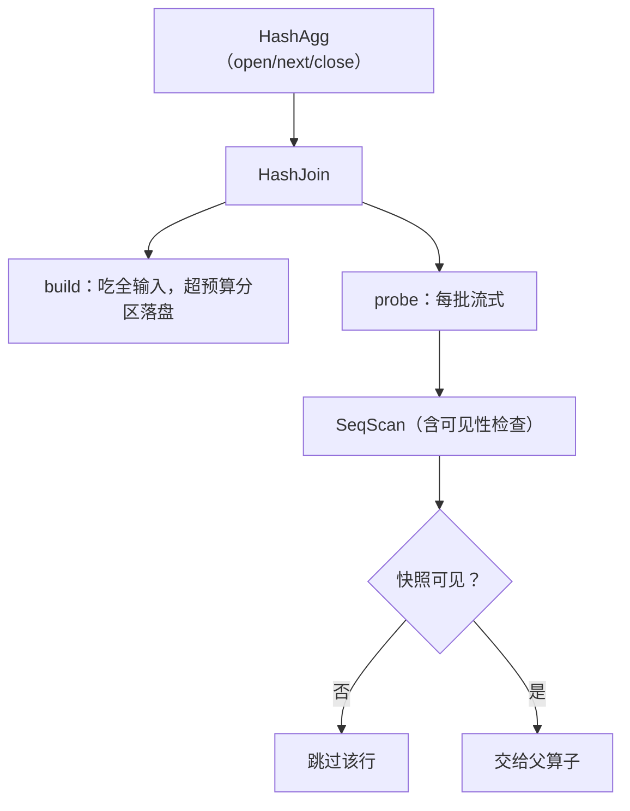

# 执行器的实现

优化器交出的是一棵树，执行器交出去的是元组流；从树到流的那段代码，决定每个周期花在哪。

<footer>—— 据 Graefe, *Query Evaluation Techniques*, ACM Computing Surveys, 1993；Zukowski et al., MonetDB/X100, CIDR 2005 整理</footer>

[上一课](/cs/dbk-lsm-implementation)把存储引擎收成「按序吐键的归并迭代器」。同一个抽象往上长一层就是执行器：优化器在[查询计划](/cs/query-plan)里选好的算子树，由执行器变成真的元组流。优化课已对照过 [Volcano 迭代器](/cs/volcano-iterator)、[向量化执行](/cs/vectorized-execution)与[编译执行](/cs/query-compilation)的机制；本课写实现：迭代器契约长什么样、每个物理算子怎么写成状态机、内存预算与取消怎么穿过整棵树。

## 问题

执行器的核心缺口只有一句话：树是静态的，流是活的。计划树在优化期定形，但每个算子在运行期是带状态的机器——排序算子要先吃完输入（阻塞算子），扫描算子吐一行算一行（流水算子）。谁保证阻塞算子不把内存吃穿？谁保证用户按了取消，一条十亿行的扫描真的会停？谁保证存储层交上来的每一行，都先过了「对我的快照可见」这道关？缺了会错在哪：内存没有预算，一个失控的哈希连接 OOM 拖死整个进程——引擎是共享服务，不是批处理作业；取消不进循环，前端早已超时，后端还在烧 CPU；可见性检查漏在扫描之外，未提交或已删除的行就流进了结果。

### 迭代器契约

每个算子实现三件套。`open` 分配状态：递归 open 子算子，自己领取内存上下文与参数。`next` 返回下一批元组或耗尽标记，内部按需调用子算子的 `next`。`close` 释放状态——包括向缓冲池归还所有 pin（第 1 课的契约在这里兑现）、关闭迭代器链、把内存还给上下文。三层纪律由此成立：内存是逐算子领取的预算，阻塞算子超预算就落盘外排（[外部排序](/cs/external-sort)与 [Grace hash join](/cs/grace-hash-join)的分相协议）；取消是一次标志检查，`next` 的批循环每轮看一眼，长扫描才可能被掐断；可见性是扫描算子的职责——每吐一行先问事务管理器（下一课）「这行对我的快照在吗」。

量级感：逐元组 `next()` 的虚调用，十亿行就是十亿次间接跳转，指令缓存反复抖动；向量化把批次定在千行量级，调用次数除以千、内层循环是紧代码——MonetDB/X100 当年量出一个数量级的差距，向量化从此成为列存引擎的地基。

## 方法

算子按「要不要吃全输入」分两类实现。流水算子不缓存输入：扫描算子持一个迭代器加一个谓词（表达式树求值——行进来按 AST 走一遍，热点表达式在绑定期已做常量折叠），选择与投影几乎是免费的包装。阻塞算子有相：哈希聚合先 build 吃全输入建哈希表、组数超预算即分区落盘，再 probe 汇出结果（[哈希聚合](/cs/hash-aggregation)）；归并连接先排两输入再归并（[排序归并连接](/cs/sort-merge-join)）；嵌套循环给一侧建索引做探测（[嵌套循环与哈希连接](/cs/nlj-hash-join)）。表达式求值自己也是个小执行器：AST 解释器起步，热度高了换 JIT——只是把「求值」这一层做成可替换的后端。

## 机制

整棵树跑起来的机制是「拉」的传递：根算子的 `next` 一路调用到叶，元组逆流而上，每层只在自己有状态的地方暂停。便宜在控制权集中——取消与内存预算顺着调用栈走；贵在逐层函数调用——向量化与编译执行都是对这一项收租方式的重构，协议本身不变。实现里最容易错的是生命周期：阻塞算子在相切换时（build 转 probe）要显式释放上一相的内存，否则预算账实不符；子算子的 `close` 必须幂等——错误路径上上层可能提前 close，已 close 的再 close 不能崩。并行执行不另起协议：把 exchange 也写成一个算子，`next` 从工作线程的队列里取批次（[并行查询与 exchange](/cs/parallel-exchange)的语义），树形代码一行不改。

## 边界

本课写火山家族的实现，列存与编译后端的内核机制课已对照，不展开；物化时机对扫描输出的影响（延迟物化）也不进。多查询之间的内存公平调度是资源管理问题，本课只有「逐算子预算」这一层。错误语义统一约定：任何算子的 `next` 抛错即整树 teardown，回滚范围由事务层（下一课）决定——执行器不自己回滚。

## 小结

- 迭代器契约三件套：open 领预算，next 查取消与可见性，close 归还 pin 与内存且幂等。
- 流水与阻塞算子分相实现：阻塞算子超预算即外排，不欠账。
- 可见性检查是扫描算子的职责，未提交的行不能流进结果。
- 向量化与编译是对「拉」的收租重构，不改协议；exchange 让并行不另起炉灶。
- 出处：Graefe, ACM Computing Surveys, 1993；Zukowski et al., CIDR 2005；Ramakrishnan and Gehrke。
