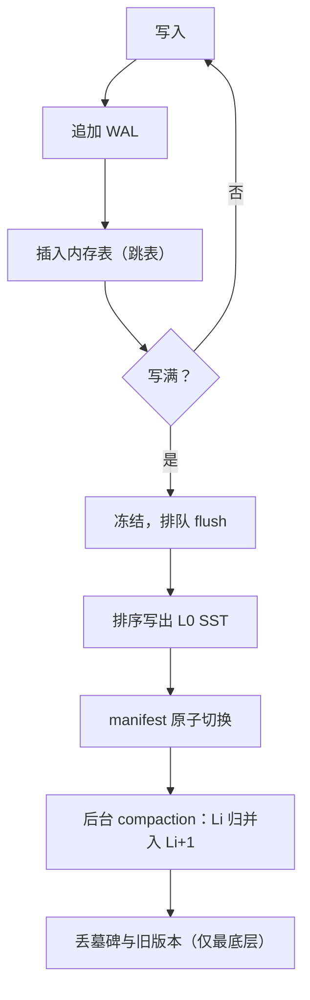
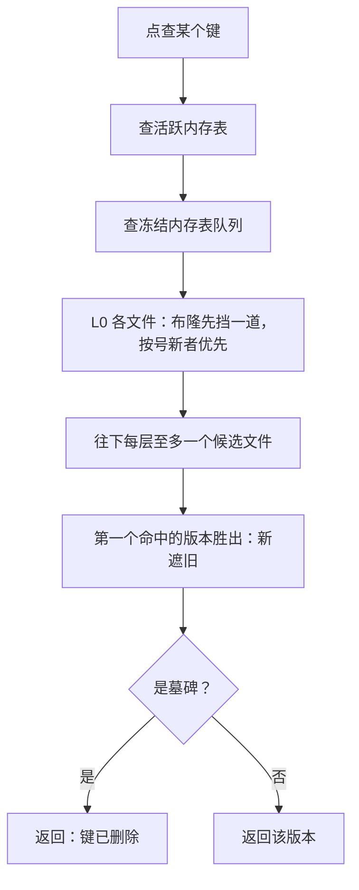

# LSM 引擎的实现

B+ 树把麻烦摊在每一次写入上，LSM 把麻烦攒起来留给自己；引擎的全部纪律，都写在「文件不可变」四个字里。

<footer>—— 据 O'Neil, Cheng, Gawlick and O'Neil, *Acta Informatica*, 1996；LevelDB 与 RocksDB 设计文档整理</footer>

[上一课](/cs/dbk-btree-concurrency)把 B+ 树的并发写在闩的全序上：读者靠右链在移动的树里走。LSM 引擎换一条路线——不做原地更新，写永远是「追加一个新文件」。主干与优化课已经算过 [LSM 与 compaction](/cs/lsm-compaction)、[读放大与布隆](/cs/lsm-read-amplification)的机制账；本课写实现骨架：一个能跑的 LSM 引擎由哪些组件构成、组件之间靠什么不变量咬合、写路径上每一步把数据放在哪。后面的执行器把它当「按序吐键的迭代器」来用。

## 问题

实现一上来要答三个问题。内存表选什么结构——要并发插入、要范围扫描、要能整体刷盘；文件格式怎么定——不可变文件写坏无法原位修补，校验与索引必须内建；层与层之间的不变量是什么——没有不变量，读就要合并任意多个文件。缺了会错在哪：墓碑若在高层 compaction 提前丢掉，被删的键还躺在更老的层里，读路径一路归并下来，删除的键「复活」——LSM 最经典的正确性事故；L0 文件若不按新旧排序读，覆盖同键的两个版本谁赢全凭运气。

「墓碑」（tombstone）是一条「这个键删掉了」的标记记录，并不真去老文件里抹数据。它必须活着挡住更老层的同名键，直到 compaction 把全部历史归并到最底层才许撤——提前撤，被删的键就从最老的层里「复活」，这是 LSM 头号正确性事故。

### 组件清单

一个最小可用的 LSM 引擎是五件套。WAL，先于内存表落盘，保证内存丢失可重放（[WAL](/cs/wal)的规则，日志机实现是本课程第 6 课的题目）。内存表，跳表——插入只改指针、无需再平衡，天然有序支持范围扫，刷盘时顺序遍历即得有序文件。不可变内存表队列，内存表写满先冻结排队，冻结期间读照常。SST 文件，数据块（键前缀压缩加重启点）、布隆过滤块、索引块、页脚，块级校验和——写坏一个块只废一个块。manifest，记录每层有哪些文件、每个文件的键区间与最大序号，它是唯一真相：文件的生效与废弃都是对 manifest 的一次原子切换。

LevelDB/RocksDB 的默认形状：L0 允许重叠、按文件号新者优先；$L_1$ 起每层是一个不重叠的有序 run，下层容量约为上层的 10 倍。「不重叠」就是读的预算——在 $L_i$ 上定位一个键至多碰一个文件。

## 方法

写路径是一条直线：追加 WAL 记录，插入内存表；写满则冻结并触发 flush——冻结表排序后写成 L0 的一个 SST，manifest 原子切换，然后才删 WAL 里对应段落。读路径是归并：点查从新到旧过内存表、L0 各文件（布隆先挡一道）、每层至多一个候选文件；范围扫描用归并迭代器把所有 run 按序吐出，同键新版本遮住旧版本——上一课「按序、可重试的迭代」在这里原样复用，只是来源从一棵树变成一组不可变文件。compaction 是后台的归并循环：按层大小对目标值之比打分，选出层与文件，把 $L_i$ 的若干文件与 $L_{i+1}$ 的重叠区间归并成新文件集，再原子切换 manifest。两次 compaction 之间，不变量由 manifest 单点维护，没有任何现场改动。

## 机制

引擎的正确性押在两条不变量上。其一，文件不可变：一经写出内容永不再改，读并发因此不需要任何闩——上一课的树闩在 LSM 里没有对应物；compaction 写新文件、切 manifest，老文件在引用计数归零前谁都还在用。其二，同键多版本按序号全序化：读快照带序号，任何 run 的同一键按（键，序号）排序，快照可见性就是一次比较；内存表与各层文件在归并迭代器里对齐后，新版本遮旧版本，墓碑遮一切更老版本。墓碑的回收因此有严格的位置约束：只有归并到最底层、确认键区间再无更老数据时才允许丢，中间层丢了就会复活。快照把回收再钉一道：长事务持着旧序号，相关版本一个都删不得——与 [MVCC 版本回收](/cs/mvcc-gc)同病，空间账单也同源。

一次点查从新到旧要走哪些站：

初学者容易以为「文件不可变」是浪费空间的设计。实际它换来的是读路径零闩：文件写完就永远不变，谁也不会改你正在读的页，读者随便并发；一切修改都表现为「写新文件加 manifest 原子切换」，而不是在旧数据上动手。

## 边界

本课不重算写放大、读放大与空间放大的账（主干 compaction 课已有），不写布隆参数（读放大课已有），也不展开写停顿的流控——只立一条：flush 与 compaction 是预算内的后台债务，追不上写速时先停写入，别让内存表无限长。WiscKey 键值分离、tiered 与 leveled 的折中（[leveled 对 tiered](/cs/leveled-tiered-compaction)），都是在这副骨架上换参数或换文件格式，不动组件边界。

写停顿可以想成洗碗：池子（内存表）有限，洗碗速度（compaction）跟不上上菜速度（写入）时，唯一正确的动作是先别上菜——短暂挡住写入，而不是让池子溢到地上。LSM 用这种可控的短期停顿，换长期不崩溃。

## 小结

- 五件套：WAL、跳表内存表、冻结队列、带校验的不可变 SST、作为唯一真相的 manifest。
- 两条不变量：文件不可变（读免闩）；同键版本按序号全序（快照即比较）。
- 墓碑只能在最底层 compaction 丢弃，早丢即删除键复活。
- 读是归并迭代器；compaction 是后台归并加 manifest 原子切换。
- 出处：O'Neil et al., *Acta Informatica*, 1996；LevelDB 与 RocksDB 设计文档。
