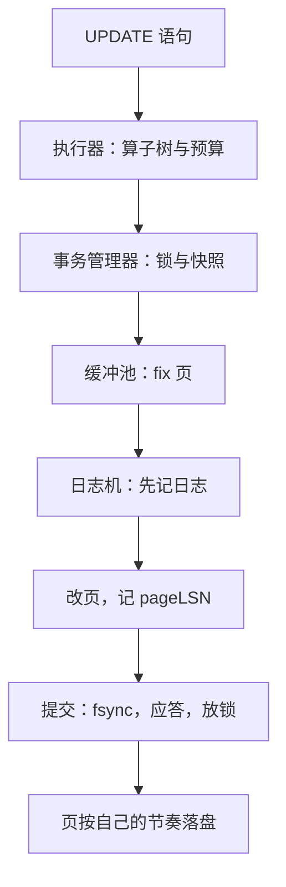

# 数据库内核实践收束

引擎不是六个组件的堆叠，是一条写路径上六个契约的接力；读懂一条 UPDATE 从 SQL 到盘上字节的全程，就读懂了内核。

<footer>—— 据 Hellerstein, Stonebraker and Hamilton, *Architecture of a Database System*, 2007；Gray and Reuter, *Transaction Processing*, 1993 整理</footer>

[上一课](/cs/dbk-wal-implementation)把提交序兑现成盘上的日志字节。本课收束「数据库内核实践」课程：把六课的组件接回一条写路径，看不变量各自放在哪一层，再给出读真实引擎源码的入口。本课程到此收束。

## 问题

收束要回答的不是新知识，而是组装：六课各立了一份契约——页与缓冲池的 fix/unpin 与「持 pin 不做 I/O」、树闩的全序、LSM 的不可变文件与序号全序、执行器的 open/next/close、事务管理器的两本账、日志机的 pageLSN 不等式——它们如何在一次 UPDATE 里咬合？分开看都对、拼起来会错在哪：不变量放错层。把页闩持有到提交，纯读开始互相阻塞；把事务锁做成全序获取，业务等待关系根本不服从；把刷页次序交给操作系统，它不认识 pageLSN。每层契约的边界感，是组装时最贵的东西。

### 一条 UPDATE 的全程

`UPDATE accounts SET bal = bal - 1 WHERE id = 7` 依次穿过：执行器的算子树——索引探测沿 B+ 树蟹行（树闩，微秒级持有），扫描吐出可见行；事务管理器——领事务、查写冲突、对目标行拿写锁（毫秒到秒级持有，直到提交或回滚）；存储层——fix 目标页进缓冲池（pin）；日志机——改页之前先追加一条 UPDATE 记录进缓冲；缓冲池——改页、页头记 pageLSN、unpin；提交——组提交队列一次 fsync，应答返回，锁释放，新版本对后到的快照可见。六个环节、六个契约、一条路径，没有一处旁路。

读源码可以按组件直接进门：PostgreSQL 的 `src/backend/storage/buffer` 与 `access/transam/xlog`；InnoDB 的 `buf0buf`、`btr0btr`、`trx0trx`、`log0log`；SQLite 的 `pager.c` 与 `wal.c`；RocksDB 的 `VersionSet` 与 `MemTableList`。文件名不同，契约相同。

## 方法

把六课压缩成一张不变量分层表：物理形状的不变量归闩——短持有、全序获取、不与 I/O 同持，守的是树与页的正确性；逻辑内容的不变量归锁与快照——长持有、可死锁要检测，守的是事务的正确性；持久性不变量归日志——顺序写、先日志后页，守的是崩溃的正确性。再用这张表读三种真实引擎：PostgreSQL 是「堆页加全套 ARIES」的教科书实现；InnoDB 把堆换成索引组织表、把 MVCC 版本收进 undo 段；RocksDB 把整个存储换成 LSM，锁与日志的接口几乎不动。组件边界稳，替换内部实现就不伤及邻层——这正是这门课把组件拆开写一遍的回报。

## 机制

本课程的机制主线只有一条：**每层用最短的持有时间保护最局部的正确性，把长的、跨语句的正确性上交**。闩管微秒，锁管事务，日志管永久；向上每层不重复下一层的工作，只引用它的契约。反例全部来自层间越权：在闩层做死锁检测（不必，全序免疫）；在锁层管页的物理互斥（锁太粗，并发立刻塌）；用 mmap 把刷盘次序交给页缓存（它不认识日志序）。副线也值得带走：迭代器与「不可变文件加原子切换」是贯穿全课的两种通用件——执行器栈在迭代器上，LSM 的 manifest 在原子切换上；认出这两种模式，读任何新引擎的源码都有把手。

## 边界

本课程刻意不覆盖：查询优化与计划缓存，是查询优化深化课的地界；分布式事务、共识与分片，在主干与分布式深化课；列存与分析执行、各类专用索引也未入。单机事务型内核的地基到此为止——再往上，是优化器在计划空间里选路，是集群把日志传给副本。

## 小结

- 六个契约一条路径：执行器、事务、缓冲池、日志、页、提交，无一处旁路。
- 不变量分层：闩管形状（短、全序），锁与快照管内容（长、可检测），日志管持久（先日志后页）。
- 层间越权是组装的头号事故：混闩与锁、让 OS 决定刷盘次序都属此类。
- 迭代器与「不可变加原子切换」是可迁移的通用件，读源码先找它们。
- 出处：Hellerstein, Stonebraker and Hamilton, 2007；Gray and Reuter, 1993；PostgreSQL、InnoDB、SQLite、RocksDB 源码树。
