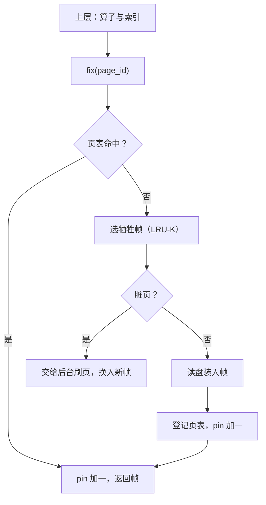
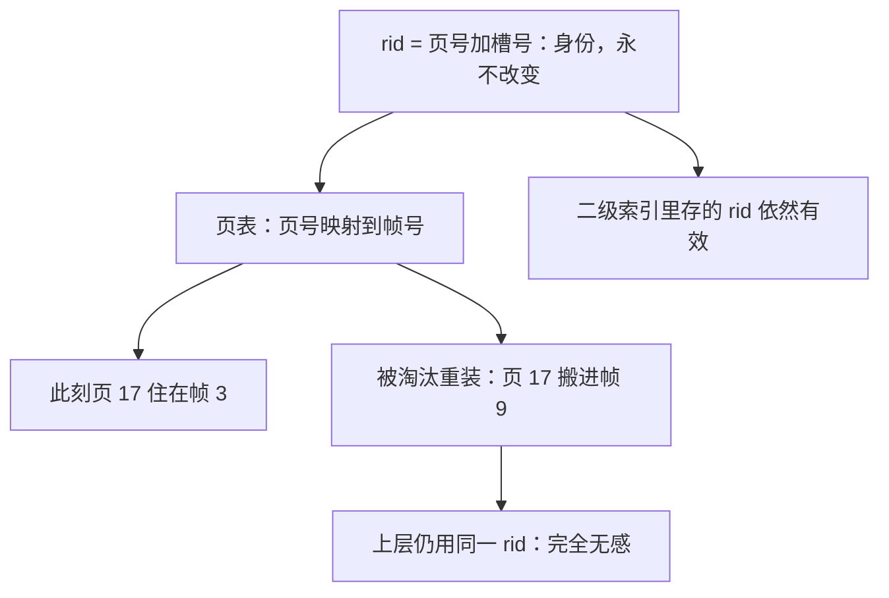

# 页结构与缓冲池的实现

数据库给上层的是一个假象：记录随取随得，磁盘仿佛不存在。制造假象的正是最底下那两层——把字节切成页，把页装进内存，谁要用谁固定。

<footer>—— 据 Hellerstein, Stonebraker and Hamilton, *Architecture of a Database System*, 2007；Gray and Reuter, *Transaction Processing*, 1993 整理</footer>

[上一课](/cs/swe-map)给「软件工程实践」收束：测试、版本、分支、构建、交付是一条链的五段，不变式是主干随时可验证、可重建、可发布——判据挂变更集，内容寻址贯穿提交与产物。交付链收口，回到数据库本体：主干已用[页与槽](/cs/page-slot)、[B+ 分裂与合并](/cs/bplus-split)、[WAL](/cs/wal)与[MVCC](/cs/mvcc)把索引和事务讲到了「机制是什么、为什么成立」。本课开始「数据库内核实践」课程：把这些机制当程序写。第一课写所有组件共享的底座——页的字节怎么排，缓冲池怎么把页 id 变成内存指针。后课默认已经读过本课。

## 问题

主干停在概念层：记录住在槽里，缓冲池按某种策略换页。实现层要把这些落成数据结构与契约：一页 8 KB 的字节里，页头、槽目录、记录各放哪；变长记录删除后的空洞归谁管；上层拿到的是 rid 还是裸指针；缓冲池被并发调用时，谁保证同一页不会装进两个帧。缺了约定会错在哪：若 rid 随页内压缩而变，二级索引里存的 rid 全部失效——索引正是靠 rid 回表（[聚簇索引与回表](/cs/clustered-secondary-lookup)），身份不稳定，索引就白建。若上层绕过缓冲池直接读写文件，脏页与刷盘次序无人守约，「先日志后页」在第一处旁路就破了。

「回表」可以想成图书馆：索引卡上只写书的位置编号（rid），真正的书在架上。编号规则必须永远不变——哪怕馆员把书在架子上挪来挪去。槽式页的「目录不动、记录可搬」保的就是这个编号。

### 槽式页的账

一页从两头向中间生长：页头与槽目录在头部，槽目录每项记（偏移，长度）；记录从页尾向前堆。删除只把槽项置空，空间留给下次页内压缩回收——压缩搬记录但不搬槽，rid（页号，槽号）因此稳定。超页的变长记录走溢出页，[变长记录与溢出页](/cs/varlen-overflow)讲过取舍；实现上多一条：溢出链的每一环也要过缓冲池，不许旁路。

PostgreSQL 的页是 8 KB，InnoDB 默认 16 KB。页大一级，顺序读省一次往返，但单条记录的写放大与缓存粒度一起变粗——页大小是全引擎最容易定下、最难反悔的常量。

## 方法

缓冲池暴露的契约只有两对动作：`fix(page_id)` 返回帧指针并把 pin 加一，`unpin(frame, dirty)` 归还。上层持 pin 期间该帧不会被替换，也不许在持页闩时做 I/O——[pin 与 latch](/cs/pin-latch)立的规矩。实现是三张小结构：帧数组（真正的字节）；页表（页 id 到帧的哈希，命中与否 $O(1)$）；空闲帧表与替换策略（LRU-K 抗扫描污染，见[缓冲池 LRU-K / 2Q](/cs/buffer-pool-lru-k)）。未命中时的次序是关键：先 pin 目标帧（预留）、再发起 I/O、最后登记页表——反过来就会出现两个线程各装一份数据、各写各的。

初学者容易觉得未命中时「先读盘、再登记」最自然。实际必须先 pin 预留帧、再发起 I/O：否则两个线程同时未命中同一页，会各装一份、各写各的，页表里冒出两个「页 17」。先预留，是防重复装入的唯一次序。

## 机制

这套契约成立的机制是「身份与位置分离」：rid 是身份，帧是位置，页表把前者映射到后者。所以页可以在帧之间搬家（替换、恢复重装），上层无感；也所以页表必须是缓冲池私有的结构，用引擎自己的锁保护。拿 OS 的页缓存替代它（mmap 方案）等于交出三件事：替换时机、刷盘次序、出错处理权。页缓存按自己的时钟淘汰，不认识 pageLSN 与日志序，文件系统层一次写回就可能把数据页先于日志送进盘里；缺页中断还会落在提交的关键路径上。所以正经引擎在数据文件上用直接 I/O（`O_DIRECT`）绕开页缓存——双缓存不是优化，是两套不沟通的策略互相打架。

页在帧之间搬家，上层为什么无感：

脏页处理同样长在契约上：牺牲帧若脏，不能持着帧把页写完再读入（持帧做 I/O 被禁止），实际做法是把脏页交给后台刷页线程或写临时副本换入新页。刷页线程让「脏」从异常变成常态，检查点与刷盘节奏是留给 WAL 课的接口。

双缓存像两个互不通话的管家各记一本库存账：OS 页缓存说「这页在我这」，引擎缓冲池也说「这页在我这」，同一份数据两本账，谁先落盘没人协调。O_DIRECT 就是告诉内核「别替我管数据文件」，只留一本账。

## 边界

本课定结构与契约，不展开替换策略的参数学（主干 LRU-K 一课已有），也不进日志序细节——「先日志后页」在这里只作为被引用的约束出现，兑现它的机制在 WAL 课。并发下同一页内容的行级正确性也不在本课：页闩管物理互斥，事务锁管逻辑冲突，分工是树并发课与事务课的事。恢复时页如何重装、rid 如何不变，同样留给 WAL 课。

## 小结

- 槽式页用「目录不动、记录可搬」保住 rid 稳定，索引回表全押在这上面。
- 缓冲池契约只有 fix/unpin；先 pin、再 I/O、后登记的次序防重复装入。
- mmap 交出替换与刷盘次序，会破坏先日志后页；数据文件走直接 I/O。
- 脏页由后台线程常态处理，检查点是它的节奏接口。
- 出处：Hellerstein, Stonebraker and Hamilton, 2007；Gray and Reuter, 1993；Ramakrishnan and Gehrke。
