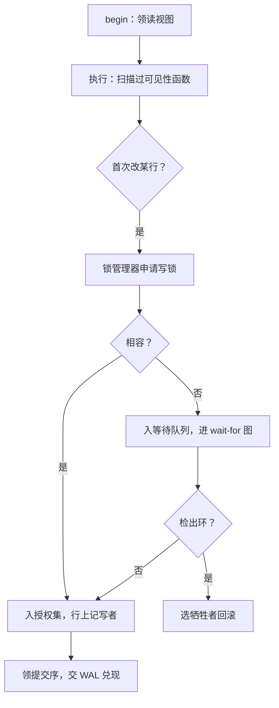

# 事务管理器的实现

执行器只管改页；什么时候这些改动算数、哪两个改动不能同时发生，是事务管理器的账本。

<footer>—— 据 Bernstein, Hadzilacos and Goodman, *Concurrency Control and Recovery in Database Systems*, 1987；Gray and Reuter, *Transaction Processing*, 1993 整理</footer>

[上一课](/cs/dbk-executor-implementation)把扫描算子的最后一道工序留了白：每吐一行先问「对我的快照可见吗」，每个改动先问「与谁冲突」。回答这两问的组件就是本课的事务管理器。主干已把[冲突可串行](/cs/conflict-serializable)、[两阶段锁](/cs/two-pl)、[MVCC](/cs/mvcc)与[快照隔离](/cs/snapshot-isolation)的语义讲清；本课写组件实现：事务对象与提交序、锁管理器的数据结构与死锁检测、可见性函数怎么查。

## 问题

实现层的事务管理器是两张账：一张按事务记（谁持有什么锁、写了什么、快照在哪），一张按资源记（哪把锁被谁持有、谁在等）。缺口在于两账必须实时一致：事务回滚了，它排队的锁申请必须同时出队，否则等待者等到的是一把死人的锁；事务提交了，它的写必须对后到的快照可见、对先前的快照不可见。再有三处细节陷阱：升级锁（读转写）不插队，同一事务排在自己后面——最简单的活锁；可见性判断用了「申请序」而不是「提交序」，读到从未提交过的数据；等待不建图，环在系统里无声地转。

### 锁管理器的账

资源表是一张哈希：资源 id 到锁头；锁头挂两个队列，已授权集合与等待队列。申请者先查兼容性：与授权集合相容则立即入集（读读相容），不相容则入等待队列。升级申请是唯一的插队规则——S 转 X 排到本资源等待队列最前，但仍须等已有的 S 全部释放。释放时从队头唤醒所有与当前授权集合相容的等待者，一并唤醒，避免逐个放行的饥饿。死锁检测在这张表上跑：等待者指向阻塞它的授权者，构成 [wait-for 图](/cs/wait-for-graph)，周期性 DFS 找环，找到就按回滚代价选牺牲者；[wait-die 与 wound-wait](/cs/wait-die) 的超时法是它的便宜替代——InnoDB 两者都有开关。

InnoDB 默认每次锁等待都即时跑 wait-for 图检测，检测本身在高并发热点行上就是 CPU 大户——所以才有「关掉即时检测、只留 50 秒超时」的生产开关。检测频率是延迟与 CPU 的旋钮，不是对错开关。

## 方法

MVCC 一侧的账更薄。事务 begin 时领一个读视图：当时已分配的最大事务号加活跃事务集合；可见性函数只做集合判断：创建者已提交且在读视图之前、删除者不存在或不可见，版本即可见。扫描算子（上一课）每行调它一次，热点路径上实现成一次位查（提交位图）加集合成员判断。写冲突按「先写者赢」：第一个改某行的事务把行上的写事务号记成自己；快照隔离下第二个并发写者到提交时才检测：核对写集是否被并发改过，有则回滚（first-committer-wins）。提交序是两本账的汇合点：事务管理器从单调序号源领提交序，再把兑现交给 WAL（下一课）。可见性按提交序、持久性按日志序，两个序必须同源，否则「已提交」与「恢复后可见」对不上。

## 机制

两阶段锁与 MVCC 在实现里不是二选一，而是分工：写写冲突由锁管理器在改动发生时挡下（阻塞或死锁回滚），读写冲突由快照吸收（读者不阻塞写者，见的是旧版本）。代价写在锁的粒度上：行锁的资源表在高并发下本身就是热点，于是有[意向锁](/cs/intention-locks)把表级判断便宜化。死锁之所以在锁层必须检测、在闩层（第 2 课）不需要，正是任意序与全序的差别：锁的等待关系由业务数据决定，没有可预先固定的获取顺序，图上就可能成环；闩的获取被协议钉成全序，环构造不出来。保存点只是账本上的栈：savepoint 记下锁与写集的标记，回滚到点即弹出其后的条目——主干讲过语义，实现是一次栈操作。

## 边界

本课不重讲隔离级别语义（主干快照隔离与异常课已给），不写多粒度锁的完整矩阵（意向锁课已有）；跨库的两阶段提交是分布式事务的事，不在单库组件之内。时间戳排序与 OCC 把冲突判定从改动时点挪到验证时点，组件边界与本课相同，账本结构不同。

## 小结

- 两张账实时一致：事务表（锁、写集、快照）与资源表（授权集、等待队列）。
- 升级插队与批量唤醒是锁管理器的两条活命规则，否则自等与饥饿。
- 可见性是提交序上的集合判断；提交序与日志序必须同源。
- 锁管写写、快照吸收读写；死锁在锁层要检测，在闩层靠全序免疫。
- 出处：Bernstein, Hadzilacos and Goodman, 1987；Gray and Reuter, 1993；Mohan et al., ARIES, TODS 1992。
