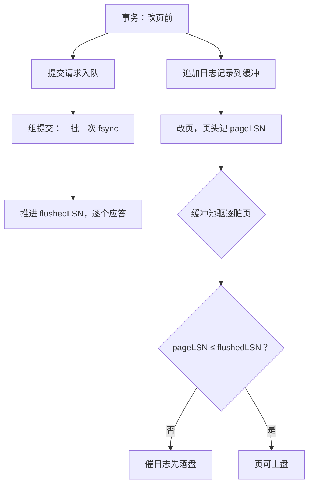

# WAL 的实现

提交不是把页写进盘，是把一条记录写进日志并等它落地；页什么时候上盘，是日志说了算。

<footer>—— 据 Mohan, Haderle, Lindsay, Pirahesh and Schwarz, ARIES, ACM TODS 17(1), 1992；Gray and Reuter, *Transaction Processing*, 1993 整理</footer>

[上一课](/cs/dbk-tx-manager)把提交序领了出来：可见性按它，冲突判定按它。缺口是最后的兑现——断电之后这个序还在不在。主干已立过 [WAL 规则](/cs/wal)与 [steal/no-force](/cs/steal-noforce)，[ARIES 三阶段](/cs/aries-phases-clr)给过恢复算法；本课写日志机本身：记录怎么编、缓冲怎么攒、fsync 在哪几个点发生、检查点写什么。这也是本课程最后一个机制组件，收束课把全部组件接回一条写路径。

## 问题

日志机的全部难点在一个不等式里：数据页可以随时、乱序、批量上盘（no-force 给了缓冲池自由，steal 允许脏页先走），唯一要守的是「页上盘之前，把它改出来的那些日志字节已经落盘」。实现就是把这个不等式变成两个可查的点：每页页头记 pageLSN（改出此页状态的最大日志序号），日志机对外报 flushedLSN（已落盘的最大序号）；缓冲池驱逐脏页前查一次 pageLSN $\le$ flushedLSN，不满足就先催日志落盘——第 1 课的驱逐路径在这里接上了钩子。漏查一次会错在哪：崩溃重启后，盘上是一个没有日志作证的新页态，REDO 无从谈起，UNDO 也找不到行——静默损坏，不是报错。

### 记录与缓冲

记录是连续字节流上的一段：自己的 LSN、同一事务前一条记录的 LSN（prevLSN，UNDO 沿这条链回溯）、类型与载荷（物理到页还是逻辑到行的取舍，[日志粒度](/cs/logging-granularity)讲过），块尾校验和防撕裂。日志缓冲是几兆到十几兆的内存尾段：追加只写内存，flushedLSN 只在 fsync 之后推进。提交是其中一类记录：事务管理器发来提交请求，日志机把它挂进队列攒批（[组提交](/cs/group-commit)）——队列里所有等待者的记录一次 fsync 全部落盘，然后逐个应答。设备账很直白：NVMe 一次 fsync 约百微秒，一提交一 fsync 的上限是每秒万级；百笔合一，这笔成本摊薄百倍，代价是队头的事务多等一拍。

「提交先于应答」是持久性的兑现点：客户端收到提交应答时，那条 COMMIT 记录已经在盘上。要更低延迟就得改承诺——提交不等落盘、或只落半程，那是持久性等级（[durability levels](/cs/durability-levels)）的生意，不是本课的默认。

## 方法

检查点是第三个 fsync 点。模糊检查点不停写入：先落一条 CKPT 记录（活跃事务表加脏页表），等它落盘，检查点即生效——REDO 的起点从日志开头前移到脏页表里最小的 recLSN。实现是后台线程周期性催刷脏页（仍守那个不等式）并补写 CKPT；检查点越勤，恢复分析越短，前台越多一次刷页开销——频率是 RTO 与吞吐的旋钮。恢复则是把不变量倒放：分析段从最后检查点起扫，重建活跃事务表与脏页表；REDO 段对脏页表里的页重复历史（不管事务是否提交，先刷到崩溃那一刻）；UNDO 段沿 prevLSN 链回滚未提交者，每回滚一条先写一条 CLR——恢复途中再崩溃，CLR 让重放幂等（[ARIES 三阶段与 CLR](/cs/aries-phases-clr)已给算法，本课给它日志机的实现）。

## 机制

这套机制扛得住乱序盘写，根子是「页的状态由一段日志定义」：盘上一页合法，当且仅当存在一段连续日志，重放它能精确得到这一页。pageLSN 与 flushedLSN 把「存在」变成可查的账，块校验和把「连续」变成可验的字节，CLR 把「重放可中断」变成结构性质。三个补丁各堵一类撕裂：日志块不满一个扇区的尾、页在半写时断电（doublewrite 或页校验和兜底，[undo/redo 与 doublewrite](/cs/undo-redo-doublewrite)讲过）、恢复中再崩溃。组提交看似优化，实则是把一次 fsync 从每事务成本摊成每队列成本；它的正确性边界在应答次序：先到的提交可以晚于后到的应答（各自等自己的记录落盘即可），但任何应答发出前，对应的 COMMIT 记录必须在 flushedLSN 之下——这个次序不能为省一次唤醒而松动。

## 边界

本课写单库日志机；复制与日志传送是另一条链路（主干有）。检查点的完整字段与 CLR 的格式，ARIES 原文与三阶段课已给，不重推。影子分页是不用日志机的另一条路，主干已对照，本课程不实现。组提交的批大小与等待时窗是调参：批越大吞吐越高、队头延迟越大，没有免费的窗口。

## 小结

- 不等式只有一条：pageLSN $\le$ flushedLSN 才许页上盘，驱逐路径是它的检查点。
- 记录四要素：LSN、prevLSN 链、类型与载荷、块校验和；缓冲只写内存，fsync 后才推进序号。
- 提交应答先于落盘是越权；组提交把 fsync 摊给一批，不摊掉承诺。
- 模糊检查点前移 REDO 起点；CLR 让恢复自身可重入。
- 出处：Mohan et al., ARIES, TODS 1992；Gray and Reuter, 1993。
