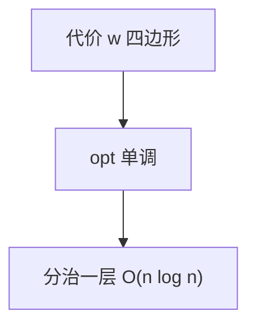

# 分治优化与四边形不等式

决策单调：$opt[i]\le opt[i+1]$ 则分治区间时 $opt$ 只在中点两侧搜；四边形不等式推出这单调，把 $O(n^2k)$ 降到 $O(n^2)$ 或 $O(kn\log n)$。

<footer>—— 据 Knuth, Optimum Binary Search Trees, 1971；Yao, Efficient Dynamic Programming, 1980 整理</footer>

上一课[斜率优化](/cs/convex-hull-trick)用直线凸包。另一类：$dp[i][k]=\min_{j<i} dp[j][k-1]+w(j+1,i)$。缺口是决策单调与四边形不等式 $w(a,c)+w(b,d)\le w(a,d)+w(b,c)$（$a\le b\le c\le d$）。不重写 CHT。后课 SMAWK 把单调完全矩阵的行最小线性求。

## 问题

无结构时 $k$ 层各 $O(n^2)$。若 $opt[i]\le opt[i+1]$：算区间 $[l,r]$ 的 DP，先算中点 $m$，枚举 $j$ 在 $[opt[l-1],opt[r]]$，再递归左右，每层 $O(n)$，$O(n\log n)$ 每 $k$。四边形 + 区间包含单调 $\Rightarrow$ 决策单调（Yao）。

缺口是这套条件，不是凸包。

### Knuth 优化更强

Knuth：$opt[i][j-1]\le opt[i][j]\le opt[i+1][j]$ 把区间 DP 从 $O(n^3)$ 降到 $O(n^2)$。矩阵链、最优 BST 满足。后课专写。本课先分治层。

Yao 1980。Knuth 1971 最优 BST。后课 SMAWK 是完全单调矩阵。

## 方法

验证 $w$ 四边形（或直接验证 $opt$ 单调）。分治算一层。或按 Knuth 限制枚举范围。

反例：不满足则不能用。

## 机制

更宽区间的最优切点不会跑到更窄的左边——交叉不等式保证换切点不亏。分治正确因 $m$ 的 $opt$ 给左右界。与 CHT：几何 vs 组合单调。

## 边界

本课不写 Knuth 区间 DP 全证明（下一课矩阵链收）。不写在线。后课默认：决策单调可分治。下一课 SMAWK。

## 小结

- 四边形不等式 $\Rightarrow$ 决策单调。
- 分治把一层 $n^2$ 变 $n\log n$。
- Knuth 区间 $O(n^2)$ 后课。
- 出处：Knuth, 1971；Yao, 1980。
