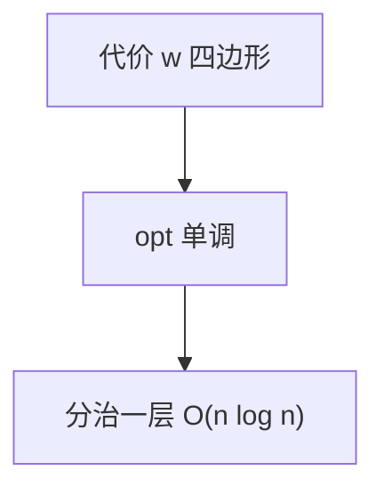
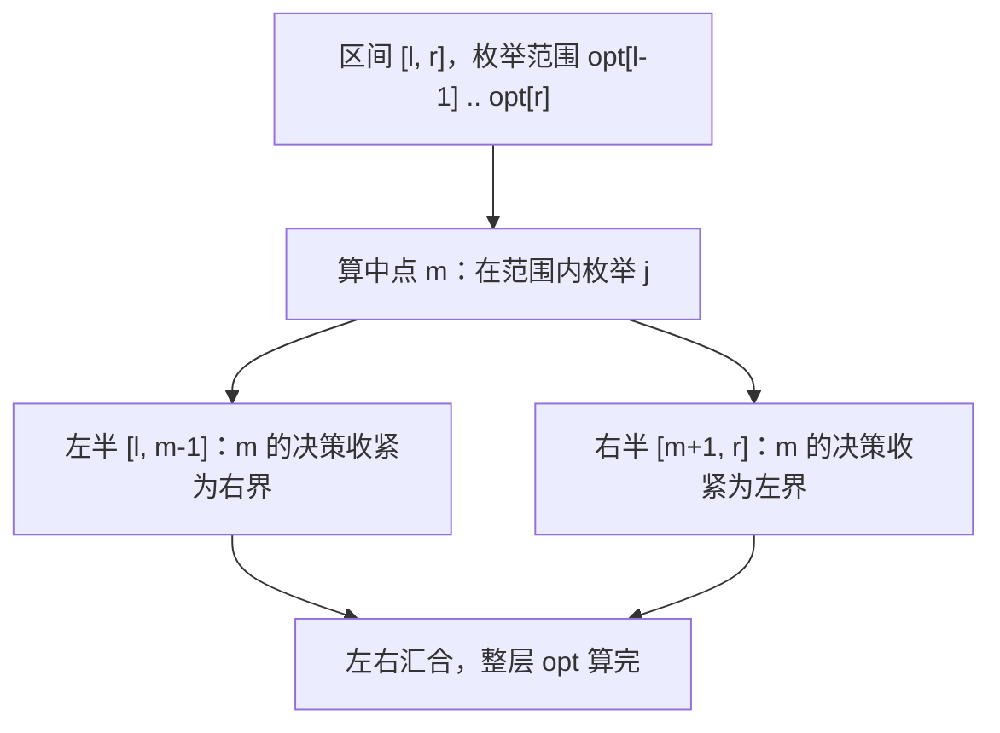

# 分治优化与四边形不等式

决策单调：$opt[i]\le opt[i+1]$ 则分治区间时 $opt$ 只在中点两侧搜；四边形不等式推出这单调，把 $O(n^2k)$ 降到 $O(n^2)$ 或 $O(kn\log n)$。

<footer>—— 据 Knuth, Optimum Binary Search Trees, 1971；Yao, Efficient Dynamic Programming, 1980 整理</footer>

上一课[斜率优化](/cs/convex-hull-trick)用直线凸包削转移；另一类优化不动几何，动决策本身，处理形如 $dp[i][k]=\min_{j\lt i} dp[j][k-1]+w(j+1,i)$ 的分层转移。缺口是决策单调与四边形不等式 $w(a,c)+w(b,d)\le w(a,d)+w(b,c)$（$a\le b\le c\le d$）。不重写 CHT。后课 SMAWK 把完全单调矩阵的行最小值线性求出。

## 问题

无结构时每层对每个 $i$ 枚举全部 $j$，$k$ 层合计 $O(n^2k)$。若最优决策满足 $opt[i]\le opt[i+1]$，分治就不必逐点搜：算区间 $[l,r]$ 时先算中点 $m$，枚举 $j$ 限制在 $[opt[l-1],opt[r]]$，再递归左右——$m$ 的决策给左半上界、给右半下界。每层枚举总量 $O(n)$，即一层 $O(n\log n)$。单调从哪来：四边形不等式加区间包含单调推出决策单调（Yao）。

缺口是这套条件，不是凸包。

术语翻译：四边形不等式说的是「交叉配对不更亏」——$a\le b\le c\le d$ 时，$w(a,c)+w(b,d)$ 不超过 $w(a,d)+w(b,c)$。直觉：代价谷底随区间整体右移，只会跟着右移或原地不动，绝不倒退，这正是决策单调的来源。

### Knuth 优化更强

区间 DP 上 Knuth 更强：$opt[i][j-1]\le opt[i][j]\le opt[i+1][j]$ 让每个区间的枚举被两条决策链夹住，总计 $O(n^2)$，把区间 DP 从 $O(n^3)$ 降下来。矩阵链、最优 BST 满足。后课专写。本课先分治层。

Yao 1980。Knuth 1971 最优 BST。后课 SMAWK 是完全单调矩阵。

## 方法

先验证 $w$ 满足四边形不等式；代数验证失败时，对小规模暴力算出 $opt$ 数组、直接看它是否单调也是合法验证。随后分治算一层：算中点、记决策、递归两侧；区间 DP 场景则按 Knuth 的两条不等式限制枚举范围。

```mermaid
flowchart TD
  W["代价 w 四边形"] --> MON["opt 单调"]
  MON --> DC["分治一层 O(n log n)"]
```

反例要记：$w$ 不满足条件时单调可能失效，硬套分治会把错误切点写进答案——验证是流程的一部分，不是仪式。

数字实例：$n=1024$ 时，朴素一层要对每个 $i$ 枚举约 $1024$ 个 $j$，共约 $10^6$ 次；分治一层每段只在中点附近枚举，总量约 $1024\times\log_2 1024=10240$ 次，直接省 100 倍——$n$ 越大差距越大。

## 机制

更宽区间的最优切点不会落到更窄区间的左边：交叉取两个切点算代价，四边形不等式立刻给出「宽区间用窄区间切点必不更优」的矛盾，直觉是代价谷底随区间右移只会右移或不动。分治的正确性靠中点桥接：$m$ 的决策既是右半的搜索下界、又是左半的搜索上界，区间减半而界不丢。与 CHT 分工：斜率优化处理转移是线性函数的几何单调，本课处理决策位置本身的组合单调，两类结构不互相包含。

直觉类比：中点桥接像猜数字游戏——先问正中间，一个答案同时裁掉两侧的范围。中点 $m$ 的最优决策正是这次「中间提问」：给左半当右界、给右半当左界，一次枚举养活两路递归。

```mermaid
flowchart TD
  LR["区间 [l, r]，枚举范围 opt[l-1] .. opt[r]"] --> M["算中点 m：在范围内枚举 j"]
  M --> RL["左半 [l, m-1]：m 的决策收紧为右界"]
  M --> RR["右半 [m+1, r]：m 的决策收紧为左界"]
  RL --> OUT["左右汇合，整层 opt 算完"]
  RR --> OUT
```

## 边界

本课不写 Knuth 区间 DP 全证明（下一课矩阵链收）。不写在线。后课默认：决策单调可分治。下一课 SMAWK。

## 小结

- 四边形不等式 $\Rightarrow$ 决策单调。
- 分治把一层 $n^2$ 变 $n\log n$。
- Knuth 区间 $O(n^2)$ 后课。
- 出处：Knuth, 1971；Yao, 1980。
