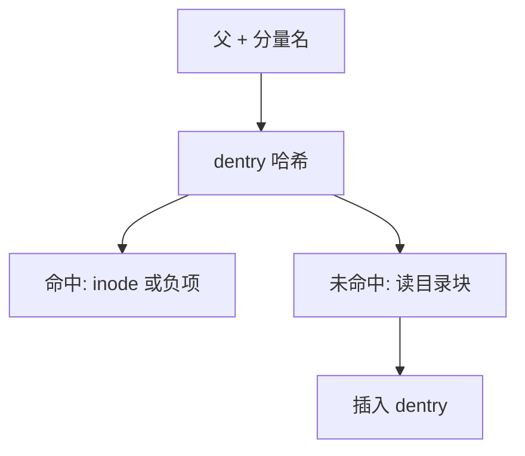

# dentry 缓存

目录项把「父目录 + 分量名」缓存成指向 inode 的内存对象；命中则不必再读目录块。

<footer>—— 据 McKusick 等对 BSD namei 的讨论；Linux VFS 对 dentry 的整理</footer>

[上一课](/cs/file-table)让 fd 抓住打开实例，路径仍是字符串。每次 `open` 若都从根把目录文件扫一遍，同样的 `/usr/lib` 会把磁盘打爆。[内存回收](/cs/memory-reclaim) 已允许收缩这类缓存。缺口是 **dentry**：负缓存（没有这个名字）也要记住，以免重复确认不存在。

## 问题

路径查找是「父 inode + 名 → 子 inode」。目录块在盘上；热点名应在 RAM。dentry 持有名、父指针、子哈希、指向 inode 的指针（或负项）。缺口不是 inode 磁盘布局——下一课才讲持久 inode——而是内存里的名字图，以及与页 Cache 的分工：页 Cache 缓存文件数据页；dcache 缓存目录关系。

本课不把 RCU 查找的全部锁级写完。

哈希键通常是父 dentry 加名。卸载与 rmdir 必须使 dentry 失效。shrinker 可以丢未使用的 dentry，释放 slab 页。

## 方法

查找分量：在父的哈希中找 dentry。命中正项则得到 inode 指针；命中负项则 ENOENT。未命中则读目录（下一课的目录文件），插入 dentry。`.` 与 `..` 可走父指针，少一次哈希。与打开文件表的关系：`open` 成功后 fd 抓住 inode/file，dentry 仍可被其他查找共享。

## 机制

dcache 把路径的局部性变成 O(1) 平均查找，让编译器反复 `stat` 头文件不必每次下盘。它依赖 slab 分配 dentry 对象，回收时是 shrinker 的主要客户之一。不要把 dentry 当成用户可见的硬链接计数；硬链接是持久 inode 上的 nlink，下一课。

[VFS](/cs/vfs) 会把 lookup 做成操作表；本课先承认缓存对象存在。

## 边界

本课不引入网络文件系统上 dentry 超时失效的全部协议。不保证负缓存在所有一致性模型下永久正确——NFS 等会到期。下一课给出盘上 inode 与目录文件的真实含义，查找算法才能说完。

后课默认：名字可以命中内存项。盘上「是什么」与「叫什么」如何分离，下一课 inode 与目录。

## 小结

- dentry 缓存父+名到 inode；负项缓存不存在。
- 与页 Cache 分工：关系对数据。
- 持久 inode 布局是下一课。
- 出处：McKusick et al., *4.4BSD*；Linux VFS 概述；Tanenbaum *MOS*。
