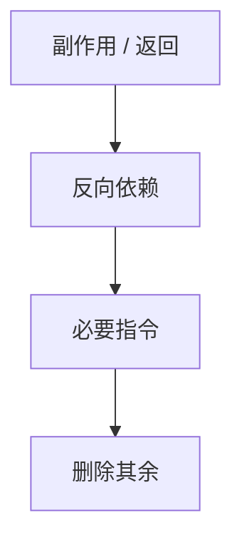

# 死代码消除与 ADCE

若赋值的结果从不被观察，且运算无副作用，则可删。激进 DCE 从必要指令反推，未碰到的一律死。

<footer>—— 据 Cytron 等 SSA；Muchnick, Advanced Compiler Design；LLVM ADCE 实践；龙书死代码整理</footer>

上一课[CSE/GVN](/cs/cse-gvn)留下拷贝与可删的重复运算。缺口是**死代码**：无用赋值、不可达块、SCCP 钉死的枝。普通 DCE 看 def-use；ADCE（aggressive）从「必要」种子（store、return、volatile、有副作用的调用）沿反向依赖与控制依赖扩张。本课钉必要集，不写完整 CDG 算法细节。

## 问题

SSA 上：若名无 use 且右部纯，删赋值。φ 的 use 没了可再删，迭代。控制流：条件若只服务死赋值，分支可折成跳转。缺口是**观察点**，不是值编号。

副作用：`free`、IO、`volatile` 是种子。语言若允许省略无观察的 store，规则随内存模型——后课 UB。

### 死不是「程序员没读变量」

逃逸到内存、通过指针读，算观察。无[别名分析](/cs/alias-analysis) 时，对 store 必须保守当活。本课标量 SSA 可激进；内存保守。

Muchnick 有 DCE 章。Cytron 指出 SSA 使死代码显然。Ferrante 等控制依赖。LLVM 的 ADCE/BDCE 是工程名。

## 方法

标记：从种子工作表反向：指令的操作数变必要；控制依赖的分支变必要。未标记删除。不可达块：CFG 从入口 DFS。

与 SCCP：不可执行边先删，减少种子。二者顺序可迭代至不动点。

## 机制

调试信息：删指令要决定是否保留位置——DWARF 后课。不要把 ADCE 当混淆器的「删所有」；种子错则改变语义。

无穷循环无副作用：C++ 曾允许删除，现更谨慎；这是语言律师问题，分析须按所选标准。

## 边界

本课不写部分死（某些路径死）。后课默认：无观察的纯赋值可删。下一课 LICM：活但循环不变的计算往外搬，不是删。

也不把 DCE 当链接期 GC 节。

## 小结

- DCE 删无 use 的纯赋值；ADCE 从观察点反推必要集。
- 内存与副作用必须当种子或保守。
- 与 SCCP 交替，清死枝。
- 出处：Cytron et al.；Muchnick；对照龙书；Ferrante 控制依赖。
