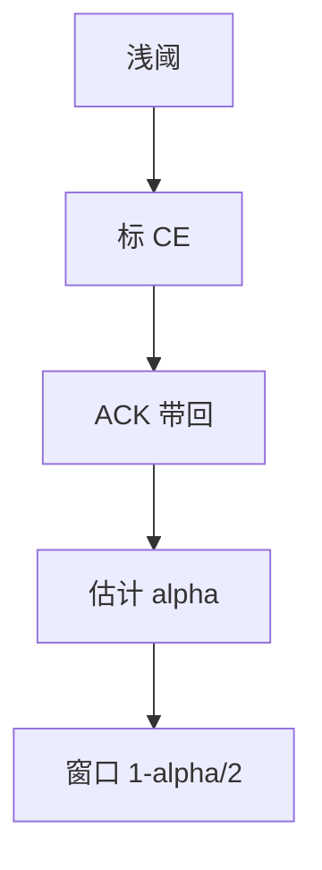

# DCTCP

交换机在浅阈标记 CE，发送方用标记比例做乘性减，把队列维持在小深度，换 incast 存活与低延迟。

<footer>—— 据 Alizadeh et al., DCTCP, SIGCOMM 2010；RFC 8257 整理</footer>

[上一课](/cs/incast) 要更早的信号。[拥塞控制](/cs/tcp-congestion) 的丢包信号太晚。缺口是 **DCTCP**：ECN 比例反馈，不是等丢。本课不把 RoCE 无损写完。主干 ECN 细节在后课传输单元再钉一次，这里只收数据中心缺口。

## 问题

Reno/CUBIC 看到丢才减半，队列已满。DCTCP：RED/阈上标 CE，不丢；发送方估计标记分数 $\alpha$，每 RTT 把窗口乘 $(1-\alpha/2)$。稳态队列贴着阈，缓冲可浅，incast 时仍有空位。与广域 CUBIC 混跑会不公平——数据中心常隔离。

不要把 DCTCP 写成 BBR：一个用 ECN 比例，一个用带宽时延模型。

RFC 8257。需要端与交换机都开 ECN。本课不调 $\alpha$ 的 EWMA 系数考试。

### 标记比例减窗

浅阈维持小队列，服务 incast 与尾延迟。需全程 ECN。与公网 CUBIC 混跑不公平。不提高口速 $C$。

## 方法

对照：丢包减半 vs 标记比例减。画：队列 ≥ 阈 → CE → 收端回 ECE → 发端调 $\alpha$。Clos 每跳都可标，信号是路径上最挤的那一跳。

方法止于选定对象与对照；机制才说它如何嵌入已有分层与主干课。

## 机制

PFC 与 DCTCP 可叠：无损给无丢语义，DCTCP 管队列深度。仅 PFC 会把拥塞停到网边。容量仍由口速决定；DCTCP 提高的是浅缓冲下的有效吞吐与尾延迟。P4 可自定义标记，不改概念。

短流可能在窗口起来前结束，主要受益是长流与同步扇入。

## 边界

本课不引入 DCQCN 的全部。RoCE 与无损网络是下一课。后课默认：DCTCP 用 ECN 比例维持浅队列，服务数据中心。

互联网核心不假设 DCTCP 邻居，故不作为公网默认。

上一课留下的缺口在本课收口；「DCTCP」进入后课词汇表后只引用。文献用来钉对象与边界，不把本课写成该主题的独立综述。下一课[RoCE 与无损网络](/cs/roce-lossless)。

## 小结

- 标记比例替代丢包减半，队列浅。
- 需全程 ECN；与 CUBIC 混跑不公平。
- 针对 incast 与尾延迟，不提高 $C$。
- 后课只引用本课钉死的对象，不从该领域总问题重开。
- 出处：Alizadeh et al., 2010；RFC 8257。
