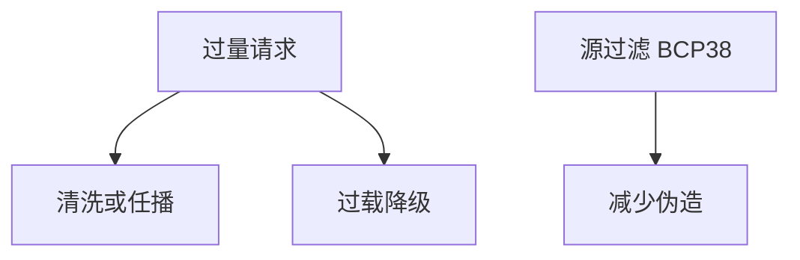

# DDoS 缓解

分布式拒绝服务用流量或连接耗尽容量。缓解是清洗、任播、过载降级与上游协作，不是在应用里再加一把锁。可用性与完整在此打架：宁可降级也不能把清洗做成永久中间人而不写进模型。

<footer>—— 据 RFC 4732；Mirkovic and Reiher 对 DDoS 的分类；对照[DoS 与放大](/cs/dos-amplify)</footer>

## 定位

上一课[蜜罐](/cs/honeypot)观扫描。缺口是**容量轴**：主干放大课已有反射。本课收缓解：清洗中心、Anycast、挑战、弹性。不写如何发动 DDoS。

后课默认已经读完本课钉下的合同，只补差，不从该领域第一性原理重开。

## 问题

带宽、状态表、应用线程都可被耗尽。缺口是分层：接入、ISP、CDN、应用过载保护。SYN 洪水与应用层洪水对策不同。

### 放大

开放解析器与 NTP 一类在主干已点名。缓解包括源头入站过滤（BCP 38）。

RFC 4732。禁止攻击指导。端口扫描下一课是侦察，不是洪水。

## 方法

对照容积与应用层。任播吸收、速率限制、降级静态页。指出 TLS 握手昂贵（密码学课已见）。

图中节点是本课的机制骨架；课程不把图展开成可运行的攻击步骤。

## 机制

可用性是 CIA 的 A。清洗改变路径，要认证与合同，否则成中间人。扫描下一课是发现面，常是洪水的前奏。

前提写进合同之后，游戏外的误用只当失败模式点名，不在本课写成操作程序。

## 边界

不写发动攻击。端口扫描与 Nmap 下一课：侦察方法论，防御视角。

## 小结

- 蜜罐不解决容量；DDoS 要清洗与降级。
- 容积与应用层对策不同。
- 源过滤减少伪造放大。
- 下一课端口扫描。
- 出处：RFC 4732；Mirkovic and Reiher；BCP 38；[dos-amplify](/cs/dos-amplify)。
