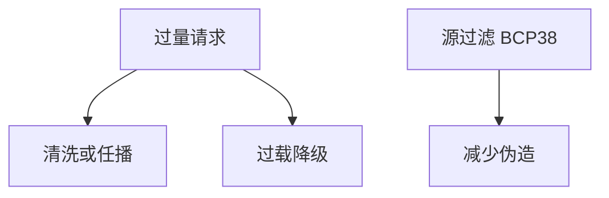
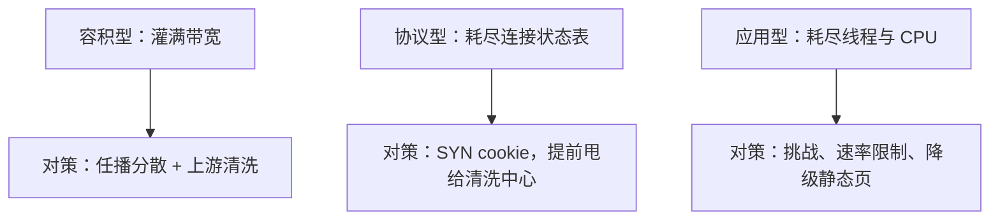

# DDoS 缓解

分布式拒绝服务用流量或连接耗尽容量。缓解是清洗、任播、过载降级与上游协作，不是在应用里再加一把锁。可用性与完整在此打架：宁可降级也不能把清洗做成永久中间人而不写进模型。

<footer>—— 据 RFC 4732；Mirkovic and Reiher 对 DDoS 的分类；对照[DoS 与放大](/cs/dos-amplify)</footer>

上一课[蜜罐](/cs/honeypot)观扫描。缺口是**容量轴**：主干放大课已有反射。本课收缓解：清洗中心、Anycast、挑战、弹性。不写如何发动 DDoS。

后课默认已经读完本课钉下的合同，只补差，不从该领域第一性原理重开。

## 问题

带宽、状态表、应用线程都可被耗尽。缺口是分层：接入、ISP、CDN、应用过载保护。SYN 洪水与应用层洪水对策不同。

术语翻译：任播（Anycast）就是让同一个 IP 在全球多个地点同时对外服务、由路由协议自动把访问导向最近一个的手段——攻击流量也被摊到几十个接入点，单一机房要扛的洪峰被切成了几十份。

### 放大

开放解析器与 NTP 一类在主干已点名。缓解包括源头入站过滤（BCP 38）。

数字实例：memcached 反射一度能把请求放大约 5000 倍——攻击者发 200 Mbps 的伪造查询，受害者就要接约 1 Tbps 的回包。这正是源头入站过滤（BCP 38）关键的原因：伪造源封不住，放大器就永远有市场。

RFC 4732。禁止攻击指导。端口扫描下一课是侦察，不是洪水。

## 方法

对照容积与应用层。任播吸收、速率限制、降级静态页。指出 TLS 握手昂贵（密码学课已见）。

```mermaid
flowchart TD
  FLOOD["过量请求"] --> SCRUB["清洗或任播"]
  FLOOD --> DEG["过载降级"]
  SRC["源过滤 BCP38"] --> LESS["减少伪造"]
```

## 机制

可用性是 CIA 的 A。清洗改变路径，要认证与合同，否则成中间人。扫描下一课是发现面，常是洪水的前奏。

常见误区：初学者容易以为「代码写快一点、锁加好一点」就能抗 DDoS。攻击耗尽的是带宽、连接表这类容量资源，服务器内部再高效也省不出上游带宽——缓解必须发生在路径上（清洗、任播、上游协作），而不是单台机器里。

```mermaid
flowchart TD
  A["容积型：灌满带宽"] --> A1["对策：任播分散 + 上游清洗"]
  B["协议型：耗尽连接状态表"] --> B1["对策：SYN cookie，提前甩给清洗中心"]
  C["应用型：耗尽线程与 CPU"] --> C1["对策：挑战、速率限制、降级静态页"]
```

## 边界

不写发动攻击。端口扫描与 Nmap 下一课：侦察方法论，防御视角。

## 小结

- 蜜罐不解决容量；DDoS 要清洗与降级。
- 容积与应用层对策不同。
- 源过滤减少伪造放大。
- 下一课端口扫描。
- 出处：RFC 4732；Mirkovic and Reiher；BCP 38；[dos-amplify](/cs/dos-amplify)。
