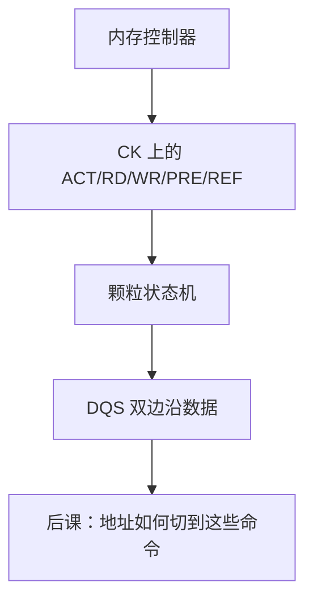

# DDR 协议与命令

  
命令/地址在时钟边沿进颗粒，数据在 DQS 双边沿进出：ACT、RD、WR、PRE、REF 是有最小间隔的序列，不是随意的 SRAM 读写脉冲。

  <footer>—— 据 JEDEC DDR SDRAM 规范；Hennessy and Patterson, CA:AQA 整理</footer>

[上一课](/cs/row-buffer-bank-conflict)用状态机语言讲了命中与冲突。缺口是 **DDR 协议**：双倍数据速率、DQS 选通、命令编码与必须遵守的间隔，把控制器从「发读写」落实到引脚级合同。

## 问题

SDR 每周期一次数据；DDR 在时钟升降沿都传（再后代 DDR2/3/4/5 速率与 bank 组不同，命令集同族）。命令：ACT（行地址）、RD/WR（列地址、突发）、PRE、REF、ZQ 校准等。缺口不是再定义行缓冲，而是：**非法命令序列**会导致不确定数据，STA 式的「最小周期」在这里变成 $t_{RCD}$、$t_{RAS}$、$t_{WR}$、$t_{RFC}$ 一串。

校准：写均衡、读 DQS 训练，PHY 的模拟活，数字控制器假定训练完成。本课承认 PHY 存在，不设计均衡器——避免滑进模拟/光刻。

### DDR 不是「总线频率的两倍就结束」

有效带宽还受突发间隙、刷新、命令带宽、bank 冲突限制。把标称 MT/s 直接当应用程序 memcpy 带宽，阿姆达尔在内存墙上会失望。ECC 颗粒占用部分宽度或另宽。

JEDEC 各代 DDR 标准是本课主文献。CA:AQA 把命令与时序接到控制器。本课不背引脚表，钉命令与双边沿数据。

## 方法

控制器维护每 bank 计时器：上次 ACT/RD 之后能否再发。命令/地址复用或按代分开。数据突发 BL8 对齐 cache 行常见。电源：自刷新在休眠时由颗粒内部刷新，对照组成[刷新课](/cs/dram-refresh)的控制器义务转移。

LPDDR 面向移动，命令与电压不同，层次仍是 bank/行。本课以 JEDEC DDR 为轴。

## 机制

地址映射把物理地址拆成通道、rank、bank、行、列，然后才变成这些命令。调度器选择下一合法命令。HBM 用类似命令集、不同封装。本课把「引脚协议」交清。

## 边界

本课不讲 GDDR 的伪通道全部差异，不把 DIMM 金手指机械写成主体。不讨论内存超频社区。不把 Transformer 权重搬迁带宽当案例。

后课默认：访存是受时序约束的命令序列；数据在 DQS 上 DDR 传送。

## 小结

- DDR：命令在 CK，数据在 DQS 双边沿。
- ACT/RD/WR/PRE/REF 带最小间隔；非法序列无定义。
- 标称速率 ≠ 应用带宽。
- 出处：JEDEC DDR；Hennessy and Patterson, CA:AQA。
