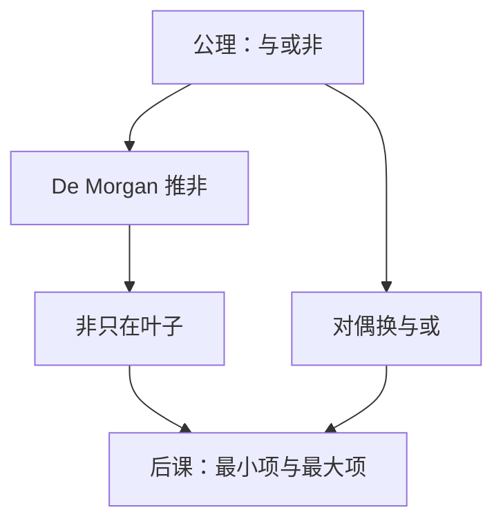

# 德摩根与对偶

把与换成或、把 $0$ 换成 $1$，定理还在；把非推进括号，与或对换——化简常常是在对偶世界里走一遭。

<footer>—— 据 De Morgan, Formal Logic, 1847；Boole, 1854；Shannon, 1938 整理</footer>

上一课[布尔代数公理](/cs/boolean-algebra)已经把 De Morgan 与对偶写进公理清单，当时不把它们当方法展开。本课不重列交换分配，也不从逻辑史另起。缺口是：公理保证能变形，还没有一套**机械地把非推进去、把 SOP 翻成 POS** 的手法。后课最小项需要对偶两套规范式，门级要把与或非收成 NAND。

## 问题

上一课指出 $1+1=1$，异或不是公理原语。表达式里的横线若只停在整式外，电路就是「先算一大块再反相」，延迟和扇出都差。缺口因此不是新公理，而是 De Morgan：

$$
\overline{x\cdot y}=\bar x+\bar y,\qquad \overline{x+y}=\bar x\cdot\bar y,
$$

以及把所有 $0/1$、$\cdot/+$ 对换后定理仍真。对偶不是「意思相反」，是代数自同构式的对称。NAND 万能在组成课才当器件事实；本课只走到：任意式可用与、或、非改写，非可以贴到叶子上。

### 对偶不是取反函数

$f$ 的对偶 $f^D$ 由对换与或零幺得到，一般 **不等于** $\bar f$。$\bar f$ 才是补函数。把两件事叫成一个词，后课 POS 会写错。

De Morgan 给出关系代数里的对偶叙述。Shannon 1938 把同一对称用在接点：串联对并联。Harris 用手算把非推到变量上再画两级门。

## 方法

反复用 De Morgan 与对合 $\overline{\bar x}=x$，直到非只作用在变量上（Nand-of-lits 的前一步）。对偶原理：从已证恒等式对换符号，得到另一条，不必再写真值表。上一课的互补律在对偶下互换。

## 机制

两级与或和两级或与互为对偶实现：1-集合的 SOP 对偶地对应 0-集合的 POS。后课[最小项](/cs/minterm-maxterm)会把这一点写成规范展开；本课只保证变形合法。CMOS 的与非、或非比与、或更自然，那是器件课：本课的对偶已经解释「为何成对出现」。

## 边界

本课不引入卡诺图，不把多级因式分解当算法。也不把布尔环的 $x+x=0$ 搬进来当 De Morgan 的特例——模 $2$ 加是另一套。集合的德摩根（补集）是[集合与关系](/cs/sets-relations)的对照，定义仍以本课代数为准。

后课默认：非可推到变量；SOP 与 POS 由对偶成对出现；化简在这两套写法上做。

## 小结

- De Morgan 把非推进括号并交换与或。
- 对偶交换 $0/1$ 与与或，定理仍成立；对偶式不是补函数。
- 规范最小项 / 最大项是下一课的构造。
- 出处：De Morgan, 1847；Boole, 1854；Shannon, 1938。
