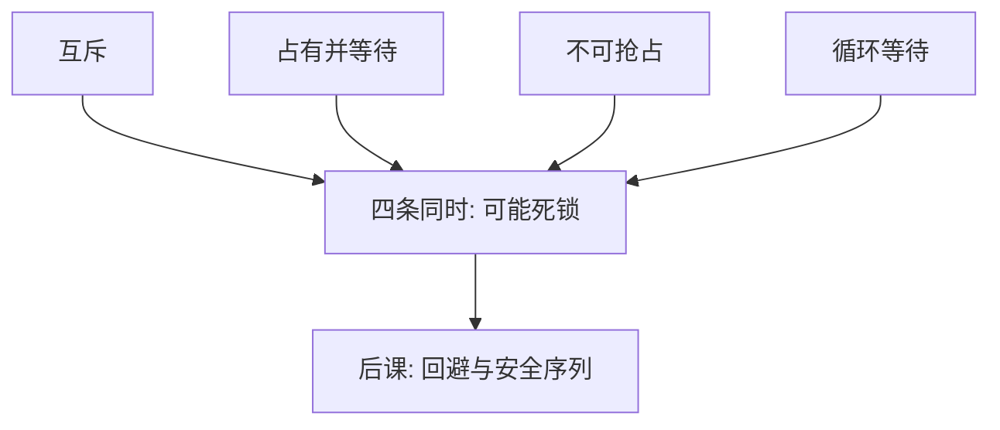

# 死锁四个条件

死锁：一组进程中每一个都在等只能由该组内另一进程释放的资源。

<footer>—— 据 Coffman, Elphick and Shoshani, System Deadlocks, Computing Surveys 1971 整理</footer>

[上一课](/cs/lockfree-aba)让对象内部的等待变清楚。两个管程、两把锁、两个信号量仍可互相等。缺口不是再换一种原语，而是刻画**何时等待集合永远走不出来**。Coffman 四个必要条件把现象收成可检查的清单。

## 问题

线程 A 持锁 $L_1$ 等 $L_2$，线程 B 持 $L_2$ 等 $L_1$。调度再公平也没用：没有人会 V 或 `signal` 到对方需要的那个。缺口是给出充要直觉：互斥、占有并等待、不可抢占、循环等待。四条同时成立才可能死锁；破坏任一条即可预防。

本课不引入银行家对「安全序列」的计算，那是下一课回避算法。这里只诊断条件。

资源分配图：进程指向它在等的资源，资源指向占有者。有向环（可重用资源、单实例）即循环等待的图说法。

## 方法

逐条对照：互斥——资源一次一个（锁、内核缓冲槽）；占有并等待——已拿 $L_1$ 再去拿 $L_2$；不可抢占——不能从持有者夺走锁；循环等待——等待图有环。预防：允许抢占（少见）、一次性申请全部、或对锁排序破坏环。检测：跑时找环；恢复：杀进程或抢资源。

## 机制

四个条件把「锁用得不对」从道德指责变成结构性质。管程内部互斥满足第一条；跨管程调用把后三条请进来。信号量没有持有者概念，循环等待仍可发生在 P 的集合上。实时课点过的优先级反转是活锁或延迟，不一定是死锁：低优先级最终可能跑完——死锁是**永远**等不到。

饥饿与死锁不同：饥饿是调度不公，图中未必有环。

## 边界

本课不处理分布式死锁的探针算法，不把数据库锁表当 OS 课的同一套实现。可消耗资源（信号）的图判定与可重用资源不同，主干以可重用锁为准。也不把活锁（忙等协议永远错过）混进四个条件。

活锁是协议永远错过（忙等互相让路），图中无环也可发生；四个条件不刻画它。

后课默认：死锁可用四条件讨论，预防靠破其中一条。若允许动态申请但要求系统始终留在「存在安全序列」的状态，下一课银行家算法。

## 小结

- 死锁：组内循环互等；Coffman 四条件同时成立。
- 破任一条件即预防；找环是检测。
- 安全序列与回避是银行家的缺口。
- 出处：Coffman, Elphick and Shoshani, *Computing Surveys*, 1971；Silberschatz et al., *OSC*。
