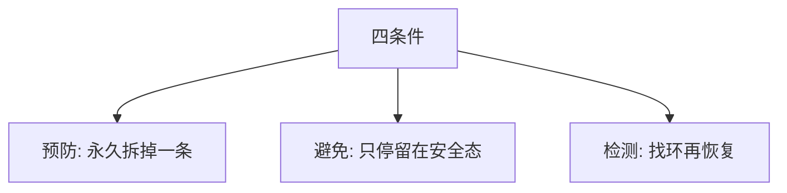

# 预防与避免

预防在设计时拆掉 Coffman 四条件之一；避免在运行时拒绝走进不安全状态——银行家是后者，锁排序是前者。

<footer>—— 据 Coffman, Elphick and Shoshani, 1971；Silberschatz et al. 对死锁处理策略的整理</footer>

[上一课](/cs/deadlock-coffman)给出互斥、占有并等待、不可抢占、循环等待。缺口是把对策分成两档：**预防**（静态拆掉一条，使环不可能）与**避免**（动态，每次分配检查安全序列）。检测并恢复是第三档，本课点名，银行家算法细节下一课。

## 问题

四条同时才可能死锁。预防：允许抢占资源（锁很难真抢）、禁止占有并等待（一次申请全部、或拿不到就放光已持有的）、或破坏循环等待（全系统锁序）。避免：进程先报最大需求，系统只进入仍存在安全序列的状态。缺口不是再举 AB-BA 例子，而是**何时用静态纪律、何时用运行时检查**。

检测：允许进可能死锁的状态，用资源分配图找环，再杀进程或抢资源。Unix 用户锁多半既不避免也不检测，靠预防式排序。

## 方法

选一条破：内核文档里的锁层级（稍后 lock-ordering 课展开）破循环等待；申请文件锁时非阻塞失败则回滚，破占有并等待。避免留给种类少、配额已知的资源。本课不把矩阵算法写完。

与[优先级反转](/cs/priority-inversion)：反转无环也可发生，不是本课对象。活锁也不是环。

## 机制

预防把正确性放到编码规范：违反锁序即可能死锁，锁依赖检测器抓动态违反。避免更灵活但要配额，通用 `malloc` 几乎给不出诚实的最大需求——所以[银行家](/cs/banker-algorithm) 是教材算法，不是 Linux 页框分配器。检测有滞后与误杀。三档都比「假装不会死锁」贵，贵在不同地方。

## 边界

本课不把分布式死锁探针写完。可消耗资源（信号量 V）与可重用锁的图论不同，主干仍以可重用锁为准。银行家的安全序列下一课专写。

后课默认：预防靠破条件，避免靠安全态。安全序列如何检查，下一课银行家算法。

## 小结

- 预防：设计时去掉四条件之一；避免：运行时不进不安全态。
- 检测是第三档；通用 OS 对用户内存很少跑银行家。
- 安全序列算法是下一课。
- 出处：Coffman et al., 1971；Silberschatz et al., *OSC*。
