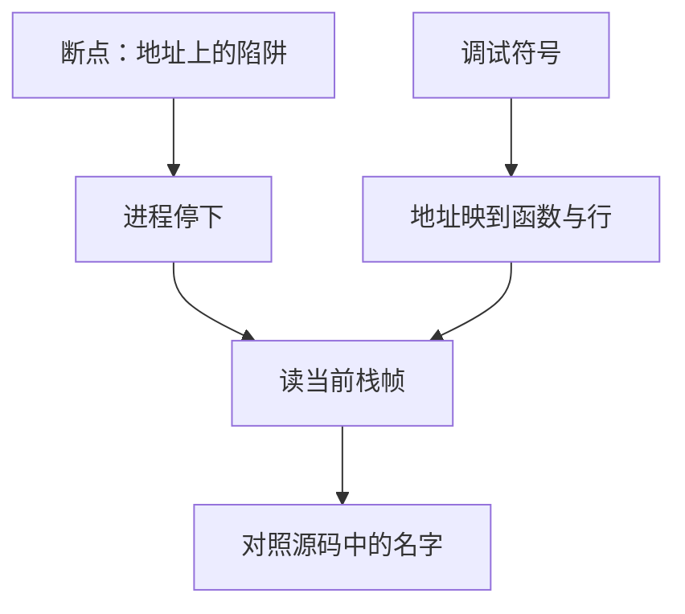

# 调试器与断点

断点把进程停在某条指令上；调试器靠符号表把地址翻译回函数与行号，从而对照源码与寄存器。

<footer>—— 据 Bryant and O'Hallaron, Computer Systems: A Programmer's Perspective；ISO/IEC 9899 整理</footer>

上一课[预处理器](/cs/preprocessor-preview)说明编译器看见的是展开后的文本。本课不重讲宏，也不从某一种调试器命令手册另起。缺口是：程序已经能链接运行，失败时需要把抽象机器上的状态**重新对准源码里的名字**。断点、单步与打印变量，依赖编译时留下的调试信息。

## 问题

进程停在入口之后，CPU 只看见地址。要把「停在 `foo` 第 12 行」说出来，镜像或旁路文件里必须有：函数名与地址范围、行号与指令的映射、局部变量在栈帧里的位置。缺口因此不是图形界面，而是**符号如何把机器状态映回源码**。没有 `-g` 一类调试信息，断点只能打在原始地址上，栈回溯只剩十六进制。

优化会让映射变糊：变量被放进寄存器或被消除，行号对应的指令被重排。这不是调试器坏了，是抽象机器与优化后的指令序列不再一行对一条。对照未定义行为课：优化后「不可能」的路径消失，断点也可能打不中你以为还在的行。

### 断点不是 `printf`

`printf` 改程序、改时序、改缓冲，失败路径上还可能自己失败。断点在进程外改控制流：插入陷阱指令或用硬件断点寄存器，命中后把控制交给调试器。观察点可以在某地址被写时停。这些不插入源码，因此更接近「原程序」——但仍改变时序，竞态可能被掩盖或被放大。本课在单线程里用它查看栈帧与指针。

CSAPP 用 GDB 把机器级程序与源码对照。ISO C 不规定调试器；调试信息格式（DWARF 等）是工具链约定。本课不把内核调试另起。

## 方法

带调试信息编译，加载进调试器，在函数或行上设断点，运行至命中，查看当前帧的参数与局部、调用栈上的返回地址链。这正是递归课那叠帧的现场版。指针值对照寿命：若对象已 `free`，地址仍可能「能读」，不能据此宣称程序合法。

核心转储是事后的同一张图：当时的寄存器与内存，配上同一份符号才能读。没有符号，只剩原始地址空间——后课进程布局会告诉那些段是什么，仍对不上局部变量名。

没有符号时仍可在入口地址下断，但局部变量只能当栈槽偏移来猜，等价于手算调用约定。剥离符号的发行版要保留一份未剥离的镜像专供事后分析，否则核心转储只能对照当时的构建标识去找。条件断点用表达式过滤命中，本身会大幅改变时序，查竞态时要当成另一种探针。本课单线程：把断点当「打印但不改源码」的手段，用来核对帧、指针与寿命，而不是当性能剖析器。

## 机制

软件断点改代码段里的一字节为陷阱，继续执行前要写回原指令。自修改与写保护会使这条路径更复杂；用户态调试器通常请内核代劳。单步是临时断点打在下一条，或用硬件单步标志。理解这些，才理解为何在只读代码映射上设断点需要权限，以及为何动态链接的共享库里的断点要等库被加载后才能解析符号。

优化与内联会让「当前行」对应一段已被拆散的指令，参数可能不在栈上而在寄存器里，甚至已被重用。这时应当下降到反汇编对照调用约定，而不是认定调试器坏了。观察点（watch）在数据地址上停，适合查「谁写了这个指针」——别名课的现场工具。核心转储配同一份未剥离符号的镜像，才能把当时的指令指针译回函数；剥离后的发行版只剩地址，必须用当时的构建产物对照。后课构建系统要保证你调试的就是图上那一份，而不是磁盘上另一份旧 `a.out`。

## 边界

本课不讲反向调试与时间旅行，不把反汇编当 ISA 课。下一课[构建系统](/cs/build-system)保证你调试的二进制与此刻源码对应。后课默认：断点停在指令地址；符号把地址译回名字；优化会削弱对应关系。没有符号的发行版要把未剥离镜像另行保存，否则事后只能对着地址猜。

硬件断点数量有限，软件断点依赖代码页可写或内核协助。对只读共享库下断，调试器通常把页临时改为可写再写回陷阱，继续时还原。这不改变源码级契约，但会让「程序未被改写」在机器上暂时为假。

## 小结

- 调试器靠符号把地址映回函数、行与栈槽。
- 断点是地址上的陷阱，不替代契约，也不证明无 UB。
- 优化使行号与变量位置变得近似；核心转储也要同一份符号。
- 下一课用构建图保证被调试的镜像来自当前源。
- 出处：CSAPP 对 GDB 与机器级对照；工具链调试信息约定。
