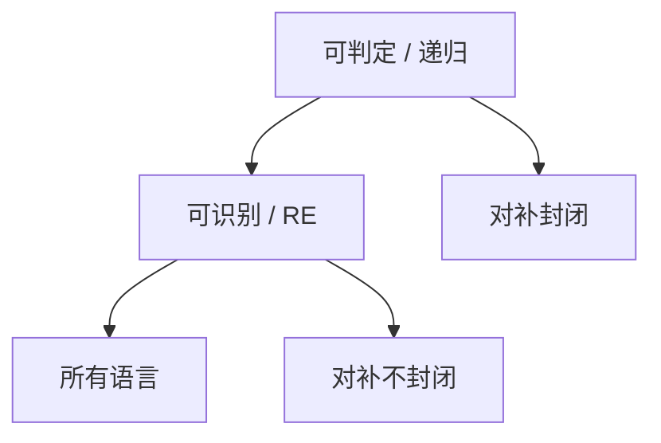

# 可判定与可识别

判定机对每个输入都停，回答是或否；识别机只保证是实例停下接受。递归可枚举可以不是递归。

<footer>—— 据 Kleene；Sipser, Introduction to the Theory of Computation 整理</footer>

上一课[Church–Turing 论题](/cs/church-turing-thesis)把算法对齐到 TM。缺口是把语言分成两类：**可判定（递归）**与**可识别（RE）**。CYK 那一层全部可判定；本课给出定义、闭包与一张表：$A_{\mathrm{TM}}$ 将出现在下一课，这里先把格子画好。

## 问题

TM 三种结局。判定器：无循环。识别器：是实例必接受停，否实例可循环。$L$ 可判定 $\Rightarrow$ 可识别。反之否：下一课的停机语言可识别不可判定。补：可判定语言对补封闭（翻接受/拒绝）；RE 对补不封闭——若 $L$ 与 $\overline L$ 都 RE，则 $L$ 可判定（两边并行，总有一边停）。

枚举器：可判定语言可按字典序无重复枚举；一般 RE 只能「有就终将打出」，顺序与重复不保证。

### 递归不是「递归函数课」

递归语言 = 可判定语言，历史名称。一般递归函数对应全可计算函数。本课用判定/识别，避免与程序递归混淆。

Kleene 的层次与 Post 的定理：$L$ 可判定 iff $L$ 与补都 RE。Sipser 第 4 章把 $A_{\mathrm{DFA}},A_{\mathrm{CFG}}$ 放在可判定，$A_{\mathrm{TM}}$ 放在可识别。本课点名这些例子，证明下一课才对角化。

## 方法

列一张表：DFA 空性、等价可判定；CFG 空性、成员可判定，等价不可判定（点名）；TM 成员不可判定。证明可判定：给总停算法。证明可识别：给识别器或枚举器。证明不可判定留给后课归约。

主干[P 与 NP](/cs/p-vs-np) 谈的是时间；这里还没有钟。可判定可以极慢。不要把「有算法」写成多项式。

## 机制

通用识别器：把 $\langle M,w\rangle$ 交给通用 TM 模拟 $M$ 在 $w$ 上，接受则接受——于是 $A_{\mathrm{TM}}=\{\langle M,w\rangle\mid M$ 接受 $w\}$ 可识别。它是否可判定是下一课的对角化。有了通用机，机器本身成为串，自指才可能。

RE 对并、交、同态封闭；对补、全称量词不封闭。本课登记并与补这一对。

$A_{\mathrm{DFA}}$、$E_{\mathrm{DFA}}$、$EQ_{\mathrm{DFA}}$ 可判定，因为最小化或乘积补交有算法。$A_{\mathrm{CFG}}$ 可判定（CYK），$EQ_{\mathrm{CFG}}$ 不可判定。这张表说明：不可判定不是「机器变复杂就自动发生」，而是过了通用 TM 这一道。本课先把判定/识别的定义用熟。

## 边界

本课不证停机，不引入算术层级。不把递归可枚举说成「可列」：所有语言作为集合都可谈基数，$\Sigma^*$ 可数，语言可数或不可数是另一句。后课默认：判定 = 总停；识别 = RE。下一课对角化打 $A_{\mathrm{TM}}$。

## 小结

- 判定总停；识别只保证是实例停。
- 两边都 RE $\Rightarrow$ 可判定；RE 对补不封闭。
- $A_{\mathrm{TM}}$ 可识别；是否可判定下一课。
- 出处：Kleene；Sipser。
