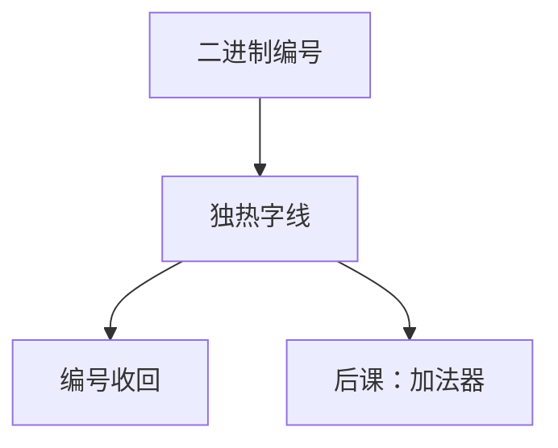

# 译码器与编码器

译码器把二进制编号点亮唯一一条选择线；编码器走反向，把「哪一根热」收成编号。

<footer>—— 据 Harris and Harris, Digital Design and Computer Architecture 整理</footer>

上一课[多路选择器](/cs/mux-select)内部其实已经用了「选择线的最小项」。本课不重写 $2^k$:1 的式子，也不从存储阵列另起。缺口是：这个「点亮一根线」的块要独立出来——寄存器堆写使能、后课存储器字线、指令操作码展开，都叫**译码器**；反向则是编码器。

## 问题

MUX 的数据端是宽总线。若只需 $2^n$ 根独热线（每次恰好一根为 1），那是 $n$ 到 $2^n$ 译码。缺口因此不是新的选择语义，而是输出形态：独热，而不是多路数据里挑值。编码器假定输入已是独热（或带优先级），输出二进制编号。两者都是组合，延迟随 $n$ 增加。

不完全指定：未使用的操作码可以当 $X$，或必须导向非法指令——与[险象课](/cs/dont-care-hazard)的 $X$ 政策相接，本课不重讲毛刺。

### 独热不是「好几根可以同时亮」

二进制计数器的输出不是独热。若干使能同时有效是另一编码，要用优先级编码器或报错。把译码器输出直接线或，会变回多驱动问题；应在设计上保证互斥，或用 MUX。

Harris 将 decoder 与 MUX 对照：MUX 是「译码后与数据与」。存储器阵列的行译码就是本课块加大驱动。编码器用于中断源编号，后课入口再接。

## 方法

$n$:$2^n$ 译码：输出 $i$ 为选择值等于 $i$ 的最小项。使能端把全体输出与上。优先编码器：输入可多 1，输出最高优先编号，并给 valid。

## 机制

后课寄存器堆：写地址经译码得到 32 根写使能之一。SRAM 行译码同构，只是扇出到整行。指令译码把 `opcode`/`funct` 变成控制独热或变成后课真值表的输入——那张表是控制课，本课只提供组合展开。

编码器压缩「哪一个请求」。无请求时 valid=0，避免把 0 号与「没有」混名。

## 边界

本课不讲模拟译码、不把 PLA 与译码器当成两种完全不同的数学——PLA 是可编程的与或平面。时序「扫描」用计数器驱动译码是后课计数器。

后课默认：地址到字线用译码器；独热与二进制的转换用编/译码组合块。

## 小结

- 译码：二进制 → 独热；编码：独热（或优先）→ 二进制。
- MUX = 译码与数据相与再或。
- 写口、字线、操作码展开都是译码器实例。
- 出处：Harris and Harris。
