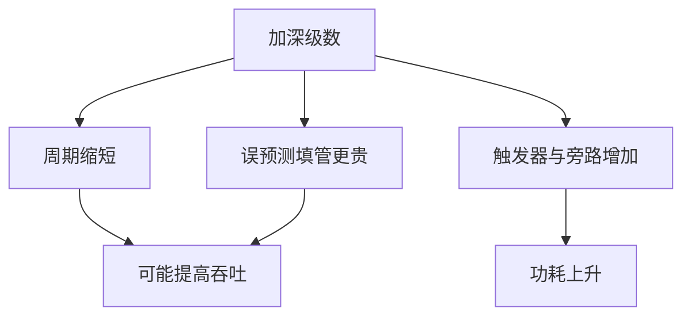

# 深流水与时钟频率

切更多级可以抬高频率，但误预测要填的级数也变多；最优深度随预测准确率、工作负载和功耗一起动，不是越深越快。

<footer>—— 据 Hartstein and Puzak, The Optimum Pipeline Depth for a Microprocessor, ISCA 2002；Hennessy and Patterson, CA:AQA 整理</footer>

[上一课](/cs/retire-precise-exception) 把架构写钉在 ROB 头，并指出级深会放大冲刷量。[五级](/cs/pipeline-five-stage) 已经用切段换频率。本课不重讲精确异常。缺口是**乱序核把流水切到 15–30 级时，时钟与误预测损失如何一起进入 CPI 公式**——Pentium 4 式超深流水的教训。

## 问题

理想情况下，级深加倍则时钟近加倍，同一 IPC 下吞吐加倍。但 [gshare](/cs/gshare-predictor) 的损失拍 ≈ 从 IF 到核对的级数；窗口更大、恢复更重，[推测恢复](/cs/speculation-recovery) 更贵。功耗随触发器数量与旁路上升。缺口不是再加一个退休口，而是**把频率收益与每条指令的额外停顿、能耗放在同一张账上**。

Hartstein–Puzak 用解析与模拟指出：存在最优流水深度；预测变差或能耗权重大时，最优点变浅。Pentium 4 的长管线后来被更短、更宽的核取代，是这条曲线的工业注脚。

## 方法

把单指令延迟写成「级数 × 周期」。吞吐仍是每拍 uop 数。优化目标可以是性能、性能/瓦或 SPEC 分数。设计旋钮：切哪一段（ALU 旁路、数据 cache 命中、前端译码）、是否加转发跨越更多级、是否用半周期设计。

## 机制

[CPI 与阿姆达尔](/cs/cpi-amdahl)：停顿项里控制冒险随级深近似线性涨，数据转发失败的气泡也涨。若工作负载分支密、预测不准，加深会让有效 CPI 涨得比频率更快，净时间变差。乱序窗口可以掩盖部分数据延迟，但掩盖不了「整条错误路径上的前端填充」。

这门课序在前端与乱序核收束：预测、重命名、IQ、LSQ、前端缓存、退休、级深，共同决定单核 ILP。下一单元转向 cache 替换与一致性协议的进阶细节。

## 边界

本课不选某个商业核的级数当标准答案。也不把多发射、多核当成「加深」的替代公式——那是并行课。功耗模型只到「触发器与投机浪费」，不去工艺库。

后课默认：更深不是自动更快；准确预测是深管线的许可证。单元切换：替换策略从 LRU 讲起，不再加宽前端。

## 小结

- 级深抬频率，同时抬误预测与功耗；存在最优深度。
- 乱序掩盖数据延迟，掩盖不了错误路径的填充。
- 下一课序从 cache 替换（LRU/PLRU）接上。
- 出处：Hartstein and Puzak, *ISCA*, 2002；Hennessy and Patterson, *CA:AQA*。
