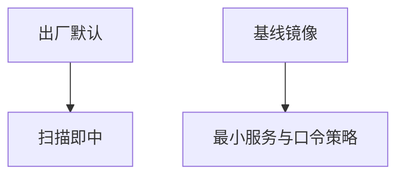

# 默认配置加固

出厂默认口令、开放管理口、示例虚拟主机，是扫描后最便宜的入口。加固基线把「开箱可用」收成「开箱最小」。

<footer>—— 据 CIS Benchmarks 的基线思想；NIST SP 800-123；对照 Anderson 对默认</footer>

## 定位

上一课[分段](/cs/network-segmentation)假定段内主机不是默认口令。缺口是**主机与中间件默认**。本课讲基线，不写利用默认口令的步骤。

后课默认已经读完本课钉下的合同，只补差，不从该领域第一性原理重开。

## 问题

设备管理界面默认账户、数据库空口令、目录列表。缺口是黄金镜像、配置即代码、关闭示例。

### 云安全组

默认 0.0.0.0/0 是分段失败。

CIS。禁止默认口令利用教程。SIEM 下一课把加固后的日志收走。

## 方法

对照 CIS/STIG 清单作过程，不是一次勾选。下一课 SIEM 与日志。

图中节点是本课的机制骨架；课程不把图展开成可运行的攻击步骤。

## 机制

攻击面来自忘记改的合同。日志下一课让改没改可被看见。

前提写进合同之后，游戏外的误用只当失败模式点名，不在本课写成操作程序。

## 边界

不写对默认管理口的利用。出厂状态要当成敌意的初始条件。SIEM 下一课。

## 小结

- 分段挡跨区；默认口令在段内仍开大门。
- 基线镜像与配置即代码。
- 云安全组默认全开等于无分段。
- 下一课 SIEM。
- 出处：CIS Benchmarks；NIST SP 800-123；Anderson。

