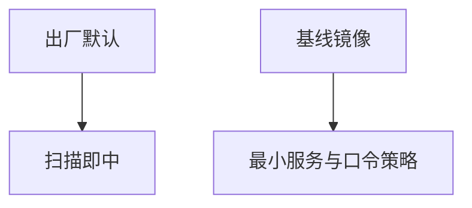
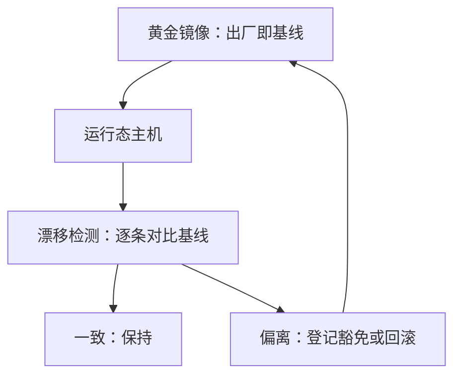

# 默认配置加固

出厂默认口令、开放管理口、示例虚拟主机，是扫描后最便宜的入口。加固基线把「开箱可用」收成「开箱最小」。

<footer>—— 据 CIS Benchmarks 的基线思想；NIST SP 800-123；对照 Anderson 对默认</footer>

上一课[分段](/cs/network-segmentation)假定段内主机不是默认口令。缺口是**主机与中间件默认**。本课讲基线，不写利用默认口令的步骤。

后课默认已经读完本课钉下的合同，只补差，不从该领域第一性原理重开。

## 问题

设备管理界面默认账户、数据库空口令、目录列表、框架示例应用（Tomcat manager、调试端点）、数据库监听全网卡。这类入口不需要漏洞：扫描器枚举出厂组合即可登录。Mirai 2016 用约六十组默认口令扫出僵尸网络，把「出厂状态是敌意初始条件」变成可测量的经济损失。缺口是黄金镜像、配置即代码、关闭示例。

数字实例：Mirai 只靠约 60 组出厂用户名口令组合，就扫出几十万设备的僵尸网络，2016 年打瘫了半个美国东海岸的 DNS 服务。攻击者没碰任何漏洞——60 组组合，每台设备一次登录尝试就够。

### 云安全组

默认 0.0.0.0/0 是分段失败：把上一课的段界换成一份全 allow 的清单。安全组要默认 deny、按端口收来源：SSH 22、RDP 3389、数据库 3306/5432/6379 只对跳板段开放。

术语翻译：fail-safe default（失败安全默认）是 Saltzer-Schroeder 安全原则之一——系统在「没人显式允许」时的状态应当是拒绝而非放行。落到配置上：安全组默认 deny、监听默认关、示例默认下线，每一条放行都要有理由、有记录、有有效期。

CIS。禁止默认口令利用教程。SIEM 下一课把加固后的日志收走。Redis/MongoDB 曾因默认无鉴权引发勒索潮；Redis 之后默认 protected-mode 只听回环。

## 方法

对照 CIS/STIG 清单作过程，不是一次勾选：条目进黄金镜像构建管线，新主机出厂即最小；配置即代码把偏离变成版本差异可审。运行态仍会漂移——补丁、临时放行、手工排障——所以基线要配漂移检测闭环。改默认口令只是第一行：关掉不用的监听、详细错误转通用错误、示例与文档端点下线；基线条目的手工豁免要带有效期，到期自动失效。下一课 SIEM 与日志。

```mermaid
flowchart TD
  DEF["出厂默认"] --> ATT["扫描即中"]
  BASE["基线镜像"] --> MIN["最小服务与口令策略"]
```

## 机制

出厂默认面向「开箱即用」：可用性最优、安全最差；基线把默认值翻成 fail-safe default（Saltzer-Schroeder 原则之一），加固是把它工程化，不是一次性动作。失败模式：基线只做一次，新版本带进新默认；豁免与临时放行无记录，漂移从此不可见；改端口只减扫描噪声，不减攻击面。攻击面来自忘记改的合同。日志下一课让改没改可被看见。

常见误区：初学者容易以为「把管理端口改成 8022」就算加固。改端口只滤掉最懒的扫描噪声，端口扫描器照样枚举全部 65535 个端口；真正的攻击面来自没改的口令、没关的监听、没下线的示例——是「忘了改的合同」，不是端口号。

```mermaid
flowchart TD
  BASE["黄金镜像：出厂即基线"] --> RUN["运行态主机"]
  RUN --> DR["漂移检测：逐条对比基线"]
  DR --> OK["一致：保持"]
  DR --> DIFF["偏离：登记豁免或回滚"]
  DIFF --> BASE
```

## 边界

不写对默认管理口的利用。出厂状态要当成敌意的初始条件；基线是过程，不替代[补丁管理](/cs/patch-management)。SIEM 下一课。

## 小结

- 分段挡跨区；默认口令在段内仍开大门。
- 基线镜像与配置即代码。
- 云安全组默认全开等于无分段。
- 下一课 SIEM。
- 出处：CIS Benchmarks；NIST SP 800-123；Anderson。
