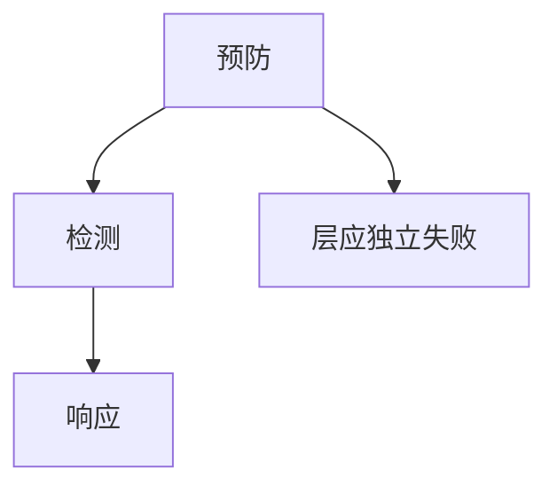

# 纵深防御

纵深防御假设单层会失败：编码、CSP、沙箱、分段、检测同时在。它反对银弹，也反对无限叠加造成无法运维的疲劳。

<footer>—— 据 NSA 对纵深的传统陈述；Saltzer and Schroeder；对照本课程各层控制</footer>

## 定位

上一课[零信任](/cs/zero-trust-architecture)是一架构原则。缺口是**多层同时存在**如何排：每层对应哪类失败。本课收口策略图。

后课默认已经读完本课钉下的合同，只补差，不从该领域第一性原理重开。

## 问题

只 WAF、只 MFA、只加密。缺口是映射：预防、检测、响应。可用安全警告层数太多则被关。

### 独立失败

两层若同一根因（同一密钥），不是纵深。

Saltzer。TCB 最小化下一课防止纵深变成巨大不可审 TCB。

## 方法

按 CIA 与杀伤链映射已讲控制。下一课 TCB 最小化。

图中节点是本课的机制骨架；课程不把图展开成可运行的攻击步骤。

## 机制

零信任是一层策略；纵深是多失败模式。TCB 下一课限制信任计算基体积。

前提写进合同之后，游戏外的误用只当失败模式点名，不在本课写成操作程序。

## 边界

不把所有产品堆进去。TCB 最小化下一课。

## 小结

- 零信任不取消其他层。
- 层必须独立失败模式。
- 太多层会被人关掉。
- 下一课 TCB 最小化。
- 出处：Saltzer and Schroeder；NSA 纵深陈述。
