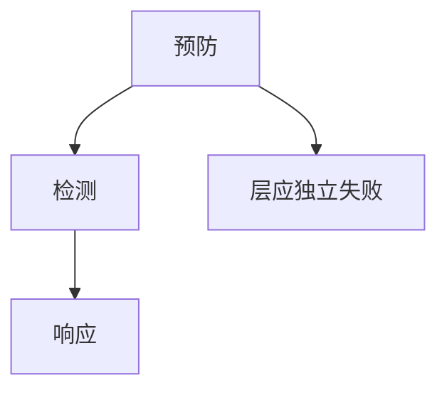

# 纵深防御

纵深防御假设单层会失败：编码、CSP、沙箱、分段、检测同时在。它反对银弹，也反对无限叠加造成无法运维的疲劳。

<footer>—— 据 NSA 对纵深的传统陈述；Saltzer and Schroeder；对照本课程各层控制</footer>

## 定位

上一课[零信任](/cs/zero-trust-architecture)是一架构原则。缺口是**多层同时存在**如何排：每层对应哪类失败。本课收口策略图。

后课默认已经读完本课钉下的合同，只补差，不从该领域第一性原理重开。

## 问题

只 WAF、只 MFA、只加密——单层把全部预算押在一个机制上，该机制失效防护即归零。缺口是映射：预防、检测、响应各覆盖哪类失败，每层把攻击者推进到哪一步必须新增能力——新漏洞、新凭据、物理接触，而不是同一工具重放。可用安全警告层数太多则被关：告警疲劳让操作员关掉控制，层数本身有运维成本。

### 独立失败

两层若同一根因（同一密钥），不是纵深。判据是失败模式相关还是独立：输出编码挡注入、CSP 挡执行、HttpOnly 挡窃取，三者对 [XSS](/cs/xss) 是三种机制；WAF 与应用共用一套正则引擎则共享缺陷，一击穿即双穿。

Saltzer。TCB 最小化下一课防止纵深变成巨大不可审 TCB。NSA 的 IATF 把纵深写成人员、技术、操作三域；Saltzer-Schroeder 八原则里最近的近亲是 separation of privilege。

## 方法

按 CIA 与杀伤链映射已讲控制：机密性靠加密与访问控制，完整性靠签名与 WORM，可用性靠冗余与限流；杀伤链各段配检测点——侦察、落点、驻留、横移、外送。设计次序是先钉每层挡什么失败，再选机制，不是先买产品再找位置；检测层要演练，规则无人响应等于没有；预防层与检测层分属不同失效假设，前者赌挡住，后者赌漏过。下一课 TCB 最小化。

```mermaid
flowchart TD
  PRE["预防"] --> DET["检测"]
  DET --> RESP["响应"]
  PRE --> IND["层应独立失败"]
```

图中节点是本课的机制骨架；课程不把图展开成可运行的攻击步骤。

## 机制

零信任是一层策略；纵深是多失败模式。零信任收紧「信任如何授予」，纵深回答「单层失效谁兜底」，二者正交：零信任网络内部仍要检测与响应。纵深与 TCB 有张力：每加一层多一块必须正确配置与审计的信任面，层叠到不可审即违背最小 TCB。经济失败模式：N 层的维护成本与告警量线性涨，各层误报相乘后放大，纵深退化成运维与预算问题（回 [安全经济学](/cs/security-economics)）。TCB 下一课限制信任计算基体积。

前提写进合同之后，游戏外的误用只当失败模式点名，不在本课写成操作程序。

## 边界

不把所有产品堆进去：层数不是指标，独立失败模式数才是。TCB 最小化下一课。

## 小结

- 零信任不取消其他层。
- 层必须独立失败模式。
- 太多层会被人关掉。
- 下一课 TCB 最小化。
- 出处：Saltzer and Schroeder；NSA 纵深陈述。
