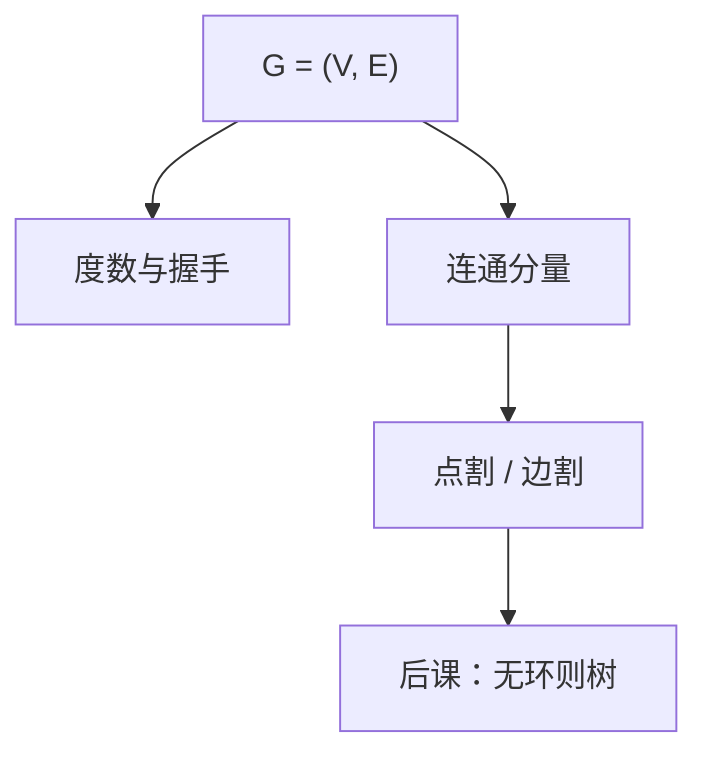

# 度、连通与割

度数是点上的边数；连通问能否走过去；割是拿掉之后图碎成两块的那一组点或边。

<footer>—— 据 Rosen, Discrete Mathematics and Its Applications；Cormen, Leiserson, Rivest and Stein 整理</footer>

上一课[图的定义](/cs/graph-definition)钉死了 $G=(V,E)$，并定义了路、连通、度数，握手引理点到为止。本课不重写有向无向，也不从「网络流」另起。缺口是：定义还没有变成后课树与遍历要用的结构事实——度为 $1$ 的叶、切掉一点是否仍连通、边割与点割哪更细。

## 问题

握手：$\sum_v \deg(v)=2|E|$。于是奇数度顶点有偶数个。缺口因此不是再给 $G$ 下定义，而是把度、连通、割连成一张图：最小度 $\delta(G)$、连通度 $\kappa(G)$（最小点割大小）、边连通度 $\kappa'(G)$，满足 $\kappa\le\kappa'\le\delta$（Whitney 不等式，本课当事实用，不写最长证明）。割点、桥（割边）是 $\kappa=1$ 或 $\kappa'=1$ 的见证。

下一课树是无环连通图，将得到「恰无环 + 连通 $\Rightarrow$ 任两边是桥」等刻画。本课先让割有名字。算法（DFS 找割点）不在本课展开。

### 割不是「画一条线穿过」

点割是顶点子集，去掉后剩余图不连通（通常要求原图连通、子集不取空或全集）。边割是边子集。示意图上的一刀若切过一个顶点，必须声明数的是点还是边。加权最小割是后课流，本课无权重。

Rosen 用握手、欧拉回路预备（奇度点）。CLRS 附录 B 给连通、割、树的词汇。本课停在无向简单图的度与割；强连通是有向后话，不在本课展开。

## 方法

算度、找 $\delta$。检查去掉一个点或一条边后分量是否增加。连通分量是极大连通子图；桥不属于任何圈——直觉留给树课用等价定义钉死。有向图的出度入度、弱连通，只声明与无向不同，不展开 Kosaraju。

## 机制

后课 BFS/DFS 的正确性用分量与距离层；稀疏图 $\delta$ 小则存在叶状结构。生成树会从每个分量长出来：不连通则没有生成树，只有森林——下一课的语言。握手给欧拉回路「零个或两个奇度点」预备，本课不证欧拉。

## 边界

本课不引入 Menger 定理全文、不把 $s$-$t$ 最小割当流。平面性、着色与度的 Brooks 界不进主干。无限图不出现。

后课默认：谈到叶、桥、割点，用本课的度与连通；树是连通无环，将推出 $|E|=|V|-1$。

## 小结

- 度数和为 $2|E|$；连通问路，割问去掉后是否破碎。
- $\kappa\le\kappa'\le\delta$；桥与割点是最弱的脆弱处。
- 无环连通的特化是下一课树。
- 出处：Rosen；CLRS 附录 B。
