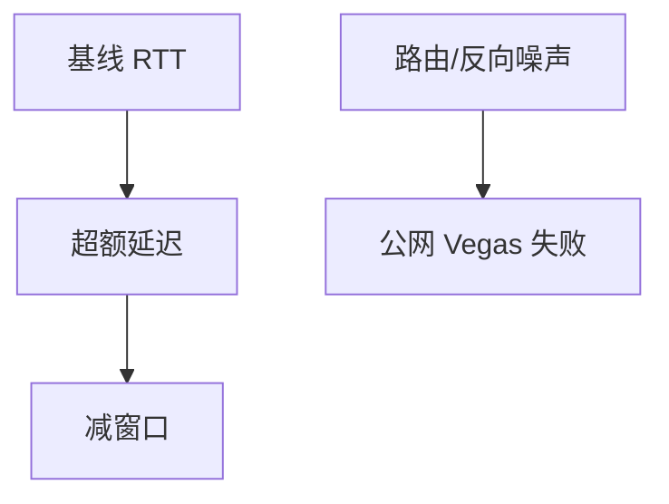

# 延迟型拥塞 Vegas / Swift

用 RTT 超过基线的量估计队列，提前减速；Vegas 在公网脆弱，Swift 把同一思想收进数据中心目标延迟。

<footer>—— 据 Brakmo and Peterson, TCP Vegas, IEEE JSAC 1995；Kumar et al., Swift, SIGCOMM 2020 整理</footer>

[BBR](/cs/bbr-v2-v3) 用 minRTT。[ECN](/cs/ecn) 用标记。[上一课](/cs/bbr-v2-v3) 不讲 Vegas 控制律。缺口是**延迟作为主信号**：Vegas 窗口规则、反向流量噪声、Swift 的 target delay。本课不把无线误码写完。

## 问题

AIMD 等丢。Vegas：比较期望吞吐与实际，RTT 升则减窗口。公网路由变化、ACK 压缩、反向拥塞让基线漂，Vegas 常输给 Reno。数据中心 RTT 干净，Swift（及 TIMELY）用 delay 梯度或目标延迟调速，服务尾延迟，可与 ECN 双信号。与 CoDel：一个在端测 RTT，一个在箱测驻留。

不要把延迟 CC 写成「不需要 AQM」的普适解。

Vegas 1995。Swift 2020 面向 DC。本课不调每个 $\alpha,\beta$。

### 延迟信号怕噪声

Vegas 在公网基线漂。Swift 把目标延迟放进数据中心。卫星传播淹没队列信号。可与 ECN 组合。

## 方法

对照：丢包 / ECN / 延迟。画：测 RTT → 相对 base → 调窗。卫星：base 已是 600 ms，队列信号淹没在传播里，延迟 CC 难。

方法止于选定对象与对照；机制才说它如何嵌入已有分层与主干课。

## 机制

DCTCP 用 CE 比例，Swift 用 delay，都可浅队列。WFQ 隔离后延迟信号更干净。MPTCP 子流 RTT 不同，延迟信号要分路径。QUIC 可在用户态实现 Vegas 变体。

公平：延迟 CC 对短 RTT 仍可能敏，但机制与 AIMD 的 $1/\mathrm{RTT}^2$ 不同。

## 边界

本课不引入 COPA 的全部效用函数。无线上的 TCP 是下一课。后课默认：延迟信号在可控 RTT 环境有用；公网噪声大。

把 Vegas 当默认公网 CC 会吃亏。

上一课留下的缺口在本课收口；「延迟型拥塞 Vegas / Swift」进入后课词汇表后只引用。文献用来钉对象与边界，不把本课写成该主题的独立综述。下一课[无线上的 TCP](/cs/tcp-wireless)。

## 小结

- Vegas 用超额 RTT 调窗，公网不稳。
- Swift 等把延迟 CC 放进数据中心。
- 与 ECN/AQM 可组合，不互相取消。
- 后课只引用本课钉死的对象，不从该领域总问题重开。
- 出处：Brakmo–Peterson, 1995；Kumar et al., 2020。
