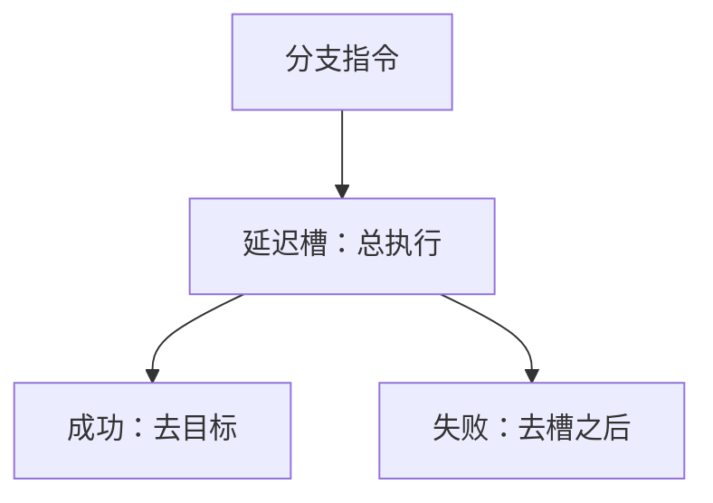

# 延迟槽对照

把分支后面那一条规定为总是执行，硬件就少冲刷一拍；代价是 ISA 把流水线深度暴露给程序员。

<footer>—— 据 Patterson and Hennessy, Computer Organization and Design (MIPS)；Hennessy and Patterson, CA:AQA 整理</footer>

[上一课](/cs/pipeline-exception)要求冲刷年轻指令、按序报告 EPC。预测失败时同样冲刷。[控制冒险与分支预测](/cs/control-hazard-predict)已把延迟槽划成「主干不用」。本课不重讲精确异常。缺口是对照：早期 RISC 为什么用软件可见的延迟槽代替冲刷，以及当代核为什么放弃它。本课只钉这一对照，不把延迟槽写进后课默认 ISA。

## 问题

五级里条件在 EX 才齐，顺序取指已经灌进 IF/ID。预测加冲刷要扔掉这些指令。另一条路：ISA 规定分支后的一条（或两条）**无论方向如何都执行**，编译器往槽里填无关指令或把目标/顺序路径上安全的指令上移。硬件少一次冲刷，CPI 看起来更好。

缺口不是新的预测器，而是承认：**这把流水线级数写进了二进制兼容**。加深流水线、超标量、延迟槽条数对不上号时，硬件仍得模拟旧语义，比冲刷更贵。

MIPS I 的 load 延迟槽与分支延迟槽是同一思想：把 RAW 或控制空档交给软件。RISC-V 整数基础没有程序员可见延迟槽。

## 方法

分支延迟槽：取指顺序上紧跟分支的那条，在目标或 PC+8 之前执行。空槽填 `nop`。编译器若找不到无关指令，槽里就是浪费的一拍——与硬件气泡同价，但编码占空间。

与预测对照：槽是架构承诺；预测是微结构猜测，错了冲刷，ISA 仍是「分支下一条即目标或顺序」。精确异常：槽里的指令若已提交，EPC 规则必须写明异常发生在分支还是槽——又一份兼容负担。

## 机制

延迟槽在单发射、浅流水、编译器能填满槽时划算。槽填不满或流水线加深后，平均收益下降，而所有未来实现都要遵守。预测器加 BTB 把控制冒险的平均损失压到低于「永远执行一条可能无用的指令」，且不污染 ISA。

[锦标赛预测](/cs/tournament-predict)的误预测率足够低时，冲刷的阿姆达尔项小于强制执行槽。这是定量选择，不是审美。

## 边界

本课不要求后课程序使用延迟槽，也不把 MIPS 延迟槽例外（annul 位）写进主干。RISC-V 课已经按无槽 ISA 讲转发与预测。浮点多周期的软件流水是编译调度，不是 ISA 槽。

后课默认：控制冒险靠预测与冲刷；CPI 公式按误预测损失计数。延迟槽只作历史对照。

## 小结

- 延迟槽把空档写成 ISA：槽内指令总执行，硬件少冲刷。
- 流水线深度与发射宽度一变，槽语义成为包袱。
- 主干继续用预测；下一课把停顿写成 CPI 与阿姆达尔。
- 出处：Patterson and Hennessy, *COD* MIPS 延迟槽；Hennessy and Patterson, *CA:AQA*；对照 RISC-V 无槽约定。
