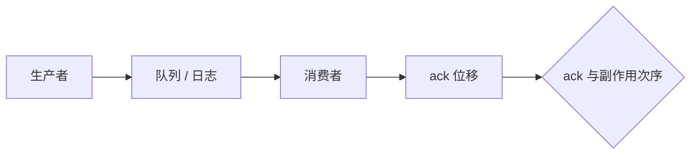

# 投递语义

消息队列保证的是 broker 与消费者之间的投递次数，不是业务效果。至少一次投递加非幂等处理，效果是至少两次。

<footer>—— 据 ISO/OSI 与分布式教材中的可靠广播分类；Kreps 等对日志投递的实践整理</footer>

上一课[RPC](/cs/rpc-semantics)谈过程执行次数。缺口是**异步消息**：生产者、队列、消费者三方，ack 点不同，词还是至少/至多/恰好，指称对象却换成「消息从队列消失几次、被处理几次」。本课钉投递，不重写桩。后课幂等键把效果钉住。

## 问题

至少一次投递：消费者可能收到重复（崩溃在 ack 前）。至多一次：可能丢（ack 先于处理）。恰好一次投递：broker 与消费者协议让每条消息对消费者的**可见处理**一次——通常用事务消费或幂等生产者 id + 去重表，底层仍常是至少一次运输。

缺口：把 Kafka `acks=all` 当恰好一次业务。那是生产者到日志的持久，不是下游两次副作用。EOS（ exactly-once semantics）是特定系统里「读-处理-写」事务的品牌，规格要读论文与文档的限定范围，本课只警告品牌 ≠ 全局恰好一次。

可靠广播、FIFO 广播、因果广播是另一轴（排序），不要和次数轴混成一个词。Birman 的 Isis 谈排序。

## 方法

画 ack 点：处理前 ack ⇒ 可丢；处理后 ack ⇒ 可重复。恰好一次效果：至少一次投递 + 幂等处理，或两者包进同一事务（消费位移与副作用同提交）。

死信、重试次数上限是工程，把无限至少一次切成有界。

## 机制

重复来源：生产者重试未收到 broker ack（要生产者幂等键）、消费者重平衡时位移回退、网络重传。丢失来源：位移先提交、broker 未刷盘就 ack、TTL 丢弃。与[RSM](/cs/replicated-state-machine)：日志提交是多数派持久，投给消费者仍是另一通道。

本课不写 Kafka 事务协议全文（后课日志课抓副本与位移）。也不把邮件 SMTP 的重试当队列定理。

与 RPC 对照：同步 RPC 的重试对应生产者重试；服务端 xid 表对应消费者去重表。换了拓扑，代数一样。

## 边界

本课不引入 Saga 补偿流。不把 MQTT QoS 0/1/2 当新理论，只点名它们是同一分类。后课默认：队列广告词先翻译成 ack 点；效果一次靠幂等或事务。下一课专讲幂等键。

次数保证有主语。主语是 broker 还是业务表，答案不同。

## 小结

- 投递次数 ≠ 业务效果次数。
- 处理后 ack 可重复；处理前 ack 可丢失。
- 恰好一次效果 = 至少一次运输 + 幂等或事务去重。
- 出处：可靠通信分类；日志系统实践（Kreps 等）。
