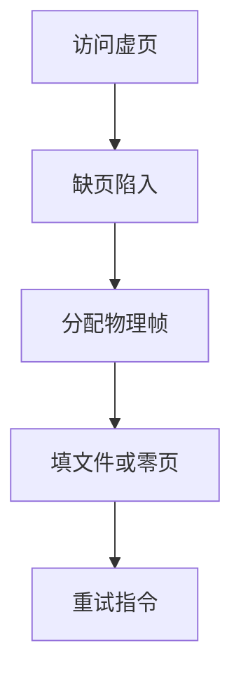
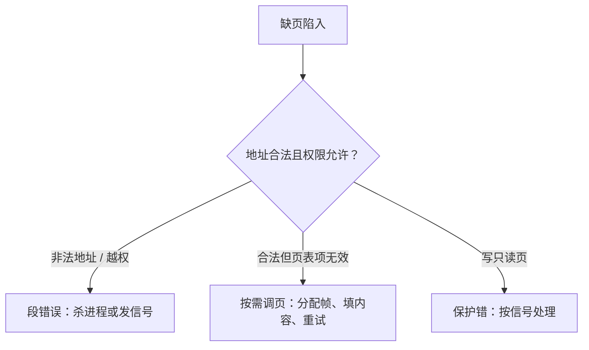

# 按需调页

不必在运行前把程序全部装入内存；第一次访问某页时再为它分配物理页。

<footer>—— 据 Denning, The Working Set Model for Program Behavior, CACM 1968；Silberschatz et al. 整理</footer>

[上一课](/cs/brk-heap)画出合法虚区间，许多页此刻仍无物理页。[分页](/cs/paging-vm)的缺页异常已经能进内核。[加载](/cs/load-dynlink)若一次装入全部文本，启动慢且浪费。[TLB](/cs/tlb-translate) 仍只缓存已填的翻译。缺口是**按需**：访问到再补页。

## 问题

进程虚空间可以远大于物理内存。若启动时为每页分配帧，机器跑不了几个进程。若永远不分配，第一次取指令就无翻译。缺口不是新的页表格式，而是策略：页表项先标无效；缺页时内核分配帧、必要时从可执行文件或交换区读入、填表、再执行那条指令。

数字实例：页大小 4 KB 时，一个声明了 2 GB 虚空间的进程共有约 52 万页。若启动即全额装帧，在一台 8 GB 内存的机器上要一次吃掉四分之一物理内存；而按需调页下，真正驻留的可能只有热循环所在的几十页。几十 KB 与 2 GB 的差距，就是「按需」两个字换来的。

本课不选哪一页被换出，那是后课置换。这里假定「还有空闲帧」。

工作集：近期触碰的页集合。Denning 用它解释为何按需加上局部性后，驻留集可以远小于虚空间。

## 方法

用户访问 → MMU 走页表 → 无效 → 缺页陷入（组成课入口）→ 内核看是非法地址则杀进程或给信号，合法则分配帧、填内容、置有效与权限 → 返回用户，硬件重试指令。文本页内容来自文件；匿名页可先填零。预调（把相邻页一并装入）是可选优化，不改「第一次触及才必须正确」这条。

## 机制

按需把[局部性](/cs/locality-principle)从 Cache 课接到 OS：只有工作集占物理内存。系统调用 `exec` 可以只建页表骨架，几乎不读磁盘，直到入口指令缺页。与运行时 GC 不同：GC 回收的是语言对象；调页回收的是帧——还没到回收，后课才缺帧。

权限仍来自分页课：只读文本写了是保护错，不是「再调一页可写」。

内核接到缺页陷入后，第一件事不是调页，而是分清这次陷入属于哪一类：

直觉类比：按需调页像图书馆按需取书——办了借书证（虚空间）不等于把整个书架搬回家；读到缺的那本，管理员（内核）才去书库取来放到桌上（分配帧），你再把那一句从头读一遍（重试指令）。证上的书目再多，桌上同时摊开的始终只有几本。

常见误区：初学者容易把所有「缺页」都当成事故。按需调页下的第一次触及缺页是正常机制，代价只是一次读文件；真正危险的是后课的抖动——帧不够时频繁换入换出，CPU 全耗在搬运上。另外注意：写只读页报的是保护错，缺页机制救不了它。

## 边界

本课不引入倒排页表实现，不把巨型页当默认。也不把交换分区的槽位分配写完。网络文件系统上的按需读文件，语义仍是「缺页时填」，延迟更大而已。

指令重试要求精确异常：缺页的那条 load/store 不能已经写坏寄存器。组成课已经要求精确，本课直接用。

后课默认：合法访问可以在缺页时才占帧。帧不够时淘汰谁，后课缺页与置换。

## 小结

- 页先无效，触及再分配并填内容。
- 工作集解释为何虚大于物仍可跑。
- 无空闲帧时的淘汰是后课。
- 出处：Denning, *CACM* 1968；Silberschatz et al., *OSC*；Tanenbaum *MOS*。
